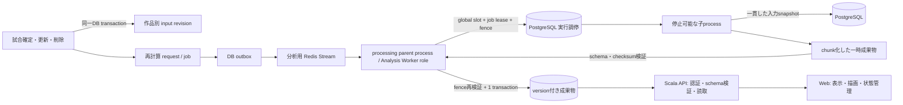

# 戦績分析バッチ 実現仕様

目的: `docs/requirements/series-analysis-batch.md` の要求を、Processing Worker runtime、DB、queue、API、Web、管理画面を
またぐ実装可能な契約へ落とす。

本書は「どう実現するか」の正本である。指標の意味と数式は
`docs/requirements/series-comparison.md`、行動プレイブックは
`docs/requirements/series-review-playbook.md`、非同期処理の要求と完了条件は
`docs/requirements/series-analysis-batch.md` を正とする。provider固有の構成値、費用、実測値、
個別障害情報は本書へ置かない。

---

## 0. 確定した実現方針

- 初回リリースの本番分析経路はRustだけで実装し、private運用要件で確定したworker memory上限を
  リリースgateとする。
- 1ジョブは1作品の全有効スコープ、集計、振り返り、ドリルダウン、試合文脈を計算する。
- APIは保存済み成果物と状態だけを読み、HTTP request内でScalaまたはRustの分析処理を呼ばない。
- DBを入力revision、job、request、outbox、成果物、公開状態の正本とする。Redis Streamsは配送だけを担う。
- 分析workerの実行枠は1とし、1作品の計算は停止可能な子processへ分離する。
- OCR v2を同居させる場合、OCRは分析を中断できるが、分析はOCRを中断できない。
- 確定済み試合の更新で作品がAからBへ移った場合は、AとBの両方を同じ業務transactionで再計算対象にする。
- 手動再計算は入力が最新でも実計算する。同一versionの現行成果物とchecksumが一致すれば成果物を再利用し、
  一致しなければ決定論違反として失敗させる。
- 戦績分析管理は管理者専用の独立メニュー「分析管理」、routeは `/admin/analysis` とする。
- 戦績比較の計算中・失敗noticeには、管理者だけ「分析管理を開く」を表示する。
- Webに残っている集計、閾値判定、候補選択、順位付け、意味を持つ強調判定はRust成果物へ移す。
  Webには表示整形、描画座標、responsive layout、URL・選択状態だけを残す。
- 試合詳細で現在Webが作る派生注目点も、試合の生データとは分離した分析成果物へ移す。確定直後は試合の
  生データを表示し、分析文脈だけを計算中として扱う。

敵対的評価で、次を初回リリースの必須条件へ引き上げる。いずれも「通常時は動く」だけでは発見しにくく、
未対応のままでは要求を満たしたと判定しない。

| 攻撃的に置く条件 | 未対策時の破綻 | 必須の実現契約 |
|---|---|---|
| deploy前後のworkerが同時に生存する | 同時実行数1と二重公開が破れる | DB上の全体実行slotと単調増加fencing token |
| running中に手動再計算を受け、直後に再読込する | 予約が画面から消える、または実行中attemptで誤って充足する | jobとは別の永続requestと未充足強制run projection |
| lease失効後に古い子processが完了する | 新しい成果物を古いworkerが上書きする | heartbeat喪失時の停止と公開transactionでのfence再検証 |
| 巨大な1作品成果物をAPIが読む | workerを軽量化してもAPIがmemory不足になる | endpoint・scope単位のbounded chunk読取とAPI/browser resource gate |
| 試合更新直後に直前artifactを表示する | 新しい一次データへ古い試合文脈を併記する | 試合単位revision照合と不一致contextの非表示 |
| API、Web、workerを別々にdeployする | 必須query追加やschema変更でflag dayになる | version付きv2 API、reader-first deploy、旧clientの明示的reload導線 |
| 一時disk不足、manifest改ざん、path逸脱が起きる | 部分公開、host file参照、常駐disk枯渇が起きる | attempt専用directory、byte上限、path/checksum検証、確実なcleanup |

要求とのtraceability:

| 確定要求 | 実現箇所 | 評価 |
|---|---|---|
| 試合確定・更新・削除、初回、algorithm更新で自動実行 | 2.1、2.3、3.2 | transaction / outbox / campaign契約まで確定 |
| 1作品で全表示データを裏計算 | 4章、5.5〜5.8、6章 | frontend監査を含め計算移管先を確定 |
| hard timeout、値は本番同等runtimeで実測後に決定 | 4.1、9.4、10章 | 機構は必須、数値達成は未測定のrelease blocker |
| 管理者が既定1作品・明示的全作品を手動実行 | 5.9、7.4 | 認証、CSRF、冪等性、予約復元まで確定 |
| 成功・失敗・timeoutと直近3件を確認、履歴45日 | 2.2、5.4、5.9、7.4 | public / admin情報境界とcleanupを確定 |
| 計算中は直前成果物を表示、初回は空状態 | 5.4、7.2、7.3 | state / artifactを分離しdecision tableを確定 |
| 失敗を表示し、直前成功日時を維持 | 5.4、7.2 | currentでも手動run失敗を隠さないprojectionへ修正 |
| Webは軽い表示加工だけ | 5.5〜5.8、6章 | business sort / fallback / emphasisをworkerへ移す契約を確定 |
| 初回からRust版、private memory上限を満たす | 4章、9.4、10章 | 構造上可能だがworker / API / browser実測までは未証明 |
| 数値正確性必須、Scala互換は希望 | 4.2、8章、9.1 | source / semantic checksumとgolden差分gateを確定 |
| 分析同時実行1、OCRだけが分析をpreempt | 3.3、11章 | DB fenceと実process preemptionを実装。production activationは別gate |
| 作品AからBへの移動は両作品を更新 | 2.1、5.8、9.2 | revision transactionと古いcontext抑止まで確定 |

---

## 1. 責務とシステム構成



| 境界 | 責務 | 持たせない責務 |
|---|---|---|
| Web | URL、filter、選択、表示文言、locale整形、chart geometry、状態表示 | 集計、閾値、候補採否、意味順、統計fallback |
| Scala API | 認証、入力検証、成果物取得、artifact pin検証、Problem Details、admin mutation | 分析、推薦、結果補完、統計fallback |
| processing parent process | delivery、全体slot、job lease、fence、timeout、preemption、子process回収、公開transaction、post-commit effect | 指標計算、巨大成果物の一括保持 |
| Analysis attempt child process | read-only snapshot取得、純粋計算、bounded chunk生成、checksum生成 | 現行成果物pointer更新、Redis ack / outbox、任意pathへの書込 |
| PostgreSQL | revision、request、job、全体slot、fence、outbox、成果物、current/previous pointerの正本 | workerの生存だけで推測した状態 |
| Redis Streams | 少なくとも1回配送、pending recovery | job状態、retry回数、分析入力・成果物の正本 |

分析runtimeは公開HTTP endpointを持たない。生存、DB heartbeat、queue待機時間、job状態で観測する。
用語は `docs/architecture.md` 5.1を正とし、Analysis Workerは親process内の論理role、consumerはその長寿命queue task、
attempt childは1回だけ実行する短寿命OS process、`momo-analysis-core`はprocessではなく能力crateを表す。

---

## 2. 再計算intentと入力revision

### 2.1 影響作品の決め方

試合mutationでは、変更前後の「確定済みデータ集合へ含まれる作品」の和集合を影響作品とする。

| 変更 | revisionを進める作品 |
|---|---|
| 下書きを作品Aの確定試合にする | A |
| 作品Aの確定試合を同じ作品内で更新する | A |
| 作品Aの確定試合を作品Bへ移す | A、B |
| 作品Aの確定試合を非確定へ戻す、または削除する | A |
| 非確定データだけを更新する | なし |

影響作品ごとに単調増加する `inputRevision` を採番し、再計算requestとqueue outboxを試合mutationと
同じtransactionへ書く。timestampや最大更新日時をrevisionの代用にしない。

入力dependencyは次へ閉じる。

| 変更 | versionへの反映 |
|---|---|
| 確定match本体、player結果、事件簿、開催・season・map所属 | 対象match revisionと影響作品input revisionを同じtransactionで進める |
| 確定matchの削除・非確定化・作品移動 | 変更前後の影響作品input revisionを進め、削除対象contextを次artifactから除く |
| player構成、scope所属など計算集合または数式入力を変えるmaster変更 | その変更経路を追加する同一変更で、影響作品input revision、または意味変更ならalgorithm versionを進める |
| 作品名、player表示名、season / map表示名など表示専用metadata | versionを進めず、APIで現在masterからhydrateする |
| Webのlabel、locale、layout | artifact versionを進めない |

この表を入力dependencyの設計正本とする。APIのmutation integration testと、実PostgreSQLへqueryを実行して
row decode・checksum・revision再利用まで確認するworker control-plane smokeで照合し、未列挙のmaster変更を
暗黙に「表示専用」とみなさない。SQL tokenの存在だけを調べるsource testは、projection順・join条件・型変換を
保証しないため契約証跡として扱わない。

現行Scala read modelのSQL監査では、計算入力は次へ限定されている。Rust版はこの列集合を出発点にし、
入力追加はdependency一覧とrevision triggerを同時に変更する。

- `matches`: ID、played at、held event ID、開催内試合番号、作品・season・map ID。
- `match_players`: member ID、play order、rank、総資産、物件収益。
- `match_incidents`: memberごとの固定6事件count。
- `members.display_name`、作品・season・map名とdisplay orderは表示metadataであり、計算checksumへ入れない。
- `held_events` の日時等は計算SQLでjoinしておらず、`matches.held_event_id` だけをfold / 開催groupのstable keyに使う。

algorithmまたはartifact schemaの更新と管理者の全作品操作は、受理時点の全登録作品へrequestを作る。
初回backfillだけは確定済み試合を持つ作品を対象にする。全作品操作は
受理transaction時点の対象作品をcampaign targetとしてsnapshotし、dispatcherで作品別request / jobへ
冪等に展開する。途中失敗で対象の一部を失わず、全作品を1つのjobへまとめない。snapshot後に初めて
確定試合を持った作品はcampaignへ後付けせず、その試合mutationの通常triggerで投入する。

### 2.2 論理データモデル

物理DDLと命名は `../momo-db` で確定するが、次の責務を分離する。

| 論理table | 主key | 責務 |
|---|---|---|
| `series_analysis_title_states` | `game_title_id` | desired input/algorithm/schema version、current/previous artifact、未充足work projection |
| `series_analysis_operation_requests` | `operation_request_id` | 手動HTTP操作、1作品/全作品scope、要求account、冪等性、受理日時、関連campaign |
| `series_analysis_job_requests` | `request_id` | 作品別trigger、要求version、手動強制run、関連operation / campaign target、充足job |
| `series_analysis_campaigns` / `campaign_targets` | `campaign_id` / `campaign_id + game_title_id` | 全作品操作ごとの対象snapshot、要求version・受理日時、展開・充足状態、件数 |
| `series_analysis_jobs` | `job_id` | 作品別target、状態、lease、時刻、retry、safe failure code、出力checksum |
| `series_analysis_job_attempts` | `attempt_id` | 実行単位の開始・終了、leased version、fence、結果、effective timeout、peak/elapsed参照用metadata |
| `worker_execution_slots` | 固定slot key | task kind、全runtimeを横断する単一実行権、owner、期限、preempt request、単調増加fencing token |
| `series_analysis_queue_outbox` | `outbox_id` | version付きdeliveryの未配送・配送済み状態 |
| `series_analysis_artifacts` | `artifact_id` | staging / published状態、manifest、version組、root checksum、成功日時 |
| `series_analysis_scope_aggregate_artifacts` | `artifact_id + scope_key` | scope単位のbounded集計payload |
| `series_analysis_scope_review_artifacts` | `artifact_id + scope_key` | scope単位のbounded振り返りpayload |
| `series_analysis_drilldown_artifacts` | `artifact_id + scope_key + member_id + metric_id` | metric別drilldown payload |
| `series_analysis_match_context_artifacts` | `artifact_id + scope_key + match_id` | 試合revision付きの事前計算文脈。1試合最大4 scope |

制約:

- 1作品につき `queued` または `running` のactive jobは最大1件とする。
- 全作品を通じて有効な計算attemptはDB execution slotのholder 1件だけとする。process内semaphore、
  Redis consumer数、runtime台数はこの制約の根拠にしない。
- current/previous pointerは同じ作品に属するpublished artifactだけを参照できる。
- scope keyは `overall`、`season`、`map`、`season_map` を型で表し、空文字や文字列連結へ依存しない。
- artifact子tableはmanifest削除に追従するが、current/previousから参照中のartifactを削除できない。
- staging artifactは成果物APIから読めず、active attemptが参照していない期限切れstagingだけをcleanupできる。
- terminal jobだけを終了日時から45日後にcleanupできる。active jobは日数で削除しない。
- job履歴にはchecksumとresult dispositionを値として保存し、削除対象artifactへの参照でcleanupを妨げない。
  output artifact IDをFKにする場合はnullableかつ削除時に参照解除し、current / previous FKだけを削除防止の
  強い参照とする。
- desired versionを進めるtransactionは、同じ作品のpending workとrequest / campaign targetも必ず作る。
  matching artifactの公開だけがpending workを成功消化でき、terminal失敗は失敗projectionを残す。
  `artifactFreshness=stale` なのにactive / pending / failed workが存在しない状態を正常状態として作らない。
- 全登録作品にtitle stateを1件用意する。導入migrationでは既存作品をbackfillし、以後の作品追加では
  master追加と同じ変更単位で `inputRevision=0` と現行algorithm / artifact schema versionのstateを作る。
  read APIで暗黙にstateを作らず、欠落は
  contract violationとして検知する。これにより確定試合がない作品も管理者の1作品・全作品再計算で
  空のoverall成果物を生成できる。
- 分析由来rowが既存の作品master削除を永久に妨げないようにする。作品削除usecaseは同じtransactionで未完了
  campaign targetを `skipped_title_deleted`、active / pending workを終了扱いにしてから、title stateとartifactを
  cascade削除する。domain entity削除は45日job保持の例外とし、親processはlease / fence消失で子を停止する。
- artifact内のseason / map IDはpublish時に作品所属を検証するが、過去artifactからの強いFKでmaster削除を
  阻害しない。現在optionsから消えたscopeはAPIで選択不能にし、古い表示名をartifactから復元しない。

### 2.3 集約と強制run

- queued中により新しい入力revisionが来た場合は、同じjobのtargetを最新版へ上げる。
- running中により新しい入力revisionが来た場合は、実行中のattemptを直ちに成功扱いしない。完了時に
  targetの再確認を行い、古い一時成果物を破棄してjobを `queued` へ戻す。
- 上記のsupersedeは失敗、timeout、transient retryへ数えない。
- 手動requestは `forceRun=true` として保存する。現行versionでも、requestより後に開始する実計算を
  少なくとも1回保証する。
- 1作品手動APIはoperation requestと作品別job requestを同じtransactionで作る。全作品手動APIはoperation
  request、campaign、target snapshotを同じtransactionで作り、target展開時に作品別job requestを冪等に作る。
  HTTPの監査・冪等単位を、計算へ集約可能な作品別work intentと同じrowへ押し込めない。
- active job中の複数手動requestは、未充足の強制run 1回へ集約してよい。各requestの監査記録は残し、
  同一入力を並列実行しない。
- active attempt開始後に受けた手動requestを、そのattemptで充足したことにしない。title stateへ
  `pendingForcedRun` を永続化し、active jobがterminalになったtransactionで次jobとoutboxを作る。
  複数requestはこの次jobへ関連付けられるが、requestごとの要求者と受理日時を失わない。
- requestは `pending`、`assigned`、`fulfilled` を区別する。attempt開始時にassignedとし、attemptの
  terminal結果を関連付けてfulfilledとする。再読込後も未充足予約と関連jobを復元できるようにする。
  `fulfilled` は成功を意味せず、要求に対応するjobがこれ以上自動継続しないterminal結果へ達したことを表す。
  成功・失敗・timeoutは関連jobの状態で別に示す。
- operation requestは、1作品なら関連job request、全作品なら全campaign targetがterminalになった時点で
  terminalにする。campaign targetは `pending | expanded | running | succeeded | failed | skipped_title_deleted`
  を区別し、失敗を成功へ読み替えずに全体進捗と監査を閉じられるようにする。
- supersede、preemption、owner消失でjobが `queued` へ戻るattemptはrequestをfulfilledにせず、pendingへ戻して
  次attemptへ関連付け直す。
- campaign targetは展開前から永続的なwork intentである。statusとqueued件数は未展開targetも含める。
  全作品手動操作の「requestより後」はdispatcher処理時刻でなくcampaign受理日時を基準にし、その後に
  開始したattemptだけを充足候補にする。
- 手動mutationのHTTP再送は同じ `Idempotency-Key` なら同じoperation requestを返す。異なるkeyは別操作として
  受理し、先行操作で開始・完了済みのattemptを後発操作の充足に使わない。複数操作の作品別job requestは、
  全要求の受理後に開始する次の強制runへ集約してよい。

同じ `inputRevision`、`algorithmVersion`、`artifactSchemaVersion` の現行成果物がある強制runでは、
canonical checksumを比較する。一致時は新しいartifactを複製せず、既存artifactを参照してjobを
`succeeded` とする。不一致時は `non_deterministic_output` で `failed` とし、現行成果物を維持する。

---

## 3. job、delivery、attemptの契約

### 3.1 job状態

| 現在 | event | 次 | retry加算 | 成果物公開 |
|---|---|---|---:|---|
| `queued` | lease取得 | `running` | なし | なし |
| `running` | version一致・検証成功 | `succeeded` | なし | あり、またはchecksum一致で再利用 |
| `running` | 新revisionでsupersede | `queued` | なし | なし |
| `running` | OCRがpreempt | `queued` | なし | なし |
| `running` | 一時的DB/queue障害 | `queued` または `failed` | 最大3回 | なし |
| `running` | timeout | `timed_out` | なし | なし |
| `running` | 決定論的計算・契約違反 | `failed` | なし | なし |

初回attemptに加えて許す自動再試行は、一時的なDB/queue障害の3回までである。lease回収、supersede、
preemptionはこの回数へ含めない。owner消失によるlease回収は計算retryと分けて `leaseRecoveryCount` に
記録し、3回を超えたjobは `lease_recovery_exhausted` で失敗させる。graceful deployで子processを終了して
leaseを返却した場合は回収回数へ含めない。attempt outcomeとしてすべて区別する。

### 3.2 queue payload

分析用streamはOCR用streamと分離し、payloadは次の最小契約にする。

```json
{
  "schemaVersion": 1,
  "jobId": "opaque-job-id"
}
```

作品、version、retry、権限、失敗状態はpayloadから信用せず、job IDでDBを読み直す。workerはDB leaseを
取得できたdeliveryだけを処理する。状態遷移と必要な次outboxをDBへ確定してから元deliveryをackする。
DB commitの成否がnetwork切断で不明になった場合は、job IDとattempt IDでDBを再読し、terminal化または
成果物公開済みを照合してからretry / ackを決める。同じpublishを推測で再実行しない。

outbox dispatcherはRedis append成功後にだけdelivery済みを記録する。append成功・DB更新失敗は同じjob IDの
重複deliveryになり得るが安全に扱う。さらに、DB上で長時間 `queued`、active leaseなし、最近のdeliveryなしを
満たすjobを定期reconcilerが再度outboxへ載せ、stream消失や誤trimで永久に孤立させない。成功した再配送は
計算retryへ数えず、同じjobの再配送間隔へbackoffを設ける。Redis append自体の連続失敗はqueueのtransient
retryとしてdurable deliveryごとに最大3回とする。同じqueued jobに別のpending / in-flight / delivered intentが
残る間はjobを早期失敗させず、利用可能なdeliveryがすべて尽きた場合だけ
`dependency_retry_exhausted` として関連request、campaign target、operationをterminalへ収束させる。

配送起動は固定短周期pollではなく、次のevent-driven契約とする。

- APIが試合mutation、1作品要求、全作品campaign、campaign target展開からoutboxをcommitした場合、同じAPI
  runtimeのcoalescing signalをcommit後にwakeする。wakeは失われてもよいhintであり、DB outboxだけを正本とする。
- Processing Workerのcontrol transactionは、outboxを作成または再武装し得る場合、commit済みvalueと
  `PostCommitEffects`相当のtyped resultを返す。effectはoutbox種別の集合であり、rollbackでは返さない。
  Analysis / OCRいずれのconsumerも、結果を受け取った直後、元deliveryのACK / leave-pending判断より前に
  共通sinkへeffectを渡す。OCR claim中の期限切れAnalysis holder回収が分析outboxを作る場合も分析wakeとなる。
- Processing Worker rootの`outbox` moduleは、容量1の種別別wake、startup drain、最短deadline、error backoff、
  bounded drain budgetを持つoutbox coordinatorを提供する。Rustの`series_analysis`側driverはsemantic reconcile、
  claim SQL、payload、Redis append、outbox状態遷移を所有し、API application責務であるcampaign展開は複製しない。
  `supervisor`はcoordinatorと両consumerをpeer taskとして監視するだけで、SQLやpayloadを知らない。
- 現在Processing Workerが作るoutboxは戦績分析だけなので、Rust側coordinator / driverは分析用1組だけを起動する。
  OCR用の空dispatcherは起動しない。将来RustがOCR outboxを書き始める場合は、同じcoordinator engineへOCR driverを
  登録し、OCR role固有loopへ配送責務を埋め込まない。
- API dispatcherはstartup時に1回drainする。その後はpost-commit wake、予約retry、5分後のsemantic
  redelivery wake、30分ごとのcold recoveryのいずれかまでDB accessを停止する。
- Rust coordinatorもstartup drain、post-commit wake、publish retry、claim expiry、semantic redeliveryの最短deadlineを
  処理するが、無条件のglobal cold sweepは持たない。Rust process停止でsignal / deadlineを失った場合は、再起動時の
  startup drainまたはAPIのglobal cold recoveryが回収する。
- APIの1回のdrainはpending campaign target展開、queued job reconcile、due outbox claim、Redis appendをbatch単位で
  繰り返す。Rustのdrainはcampaign展開を除く同じoutbox lifecycleを繰り返す。どちらもworkが空になれば終了し、
  batch上限へ連続到達した場合は自分自身を再wakeして1 taskを無制限に占有しない。
- Redis append成功とoutbox `delivered`更新成功の両方を確認してから、5分後のone-shot semantic wakeを予約する。
  その時点でjobが`running`またはterminalなら何も作らず終了し、まだ`queued`かつ最近のdeliveryがなければ
  新しいreconcile outboxを作成して同じdrain内でpublishする。
- API / Rust coordinatorは用途ごとに最短deadlineを1つだけ保持する。jobまたはoutboxごとのtimer taskを作らず、
  deadline到達後のdrainで次の最短時刻をDB stateから再計算する。`delivered`確定後はそのrowのactive dispatchを
  終了し、必要ならsemantic deadlineだけを残して待機へ戻る。
- publish失敗で`pending`へ戻したoutboxは、同じruntimeが生存している間は`next_attempt_at`に合わせてwakeする。
  dispatch失敗はcommit済みattempt結果や元delivery dispositionを巻き戻さない。process停止でtimerが失われた
  場合もstartupまたはAPI cold recoveryが引き継ぐ。
- drain全体がDB接続失敗などで完了できない場合は、coordinatorが最大60秒の指数backoffを1つだけ保持して
  再試行する。backoff中の追加wakeは保持するが即時retryの理由にはせず、正常drain後にbackoffをresetする。
  recoverable dependency errorはcoordinator内で処理し、unexpected coordinator exitはsupervisorがruntime failureとして
  sibling taskを停止する。

初期設定は`SERIES_ANALYSIS_OUTBOX_RECOVERY_INTERVAL_SECONDS=1800`、
`SERIES_ANALYSIS_OUTBOX_REDELIVERY_AFTER_SECONDS=300`とする。30秒のdispatcher poll設定は削除し、旧loopとの
dual runやfeature flagは設けない。APIとProcessing Workerが同時にdispatchしても、outbox claimとDB job claimのfencingで
重複を安全に収束させる。

Analysis Worker roleは起動時にsupportするalgorithm / artifact schema versionのexact setを宣言し、job claim SQLでも
target versionがそのsetに含まれることを条件にする。非対応deliveryを未知versionで計算・失敗扱いにせず、
DB上のjobを `queued` のまま保つ。元deliveryをackする場合は、compatible consumerへ再配送できるdurable outbox
intentを同じDB transactionで先に作る。非対応deliveryの継続は構成不整合として観測し、計算retryへ数えない。

### 3.3 全体実行slot、lease、fencing、回収

processing parent processは次の順で、同じDB transaction内に全体実行権を確立する。

1. DB時刻で期限切れと判定できる固定execution slotをlockする。
2. slotの単調増加 `fencingToken` を進め、owner、job、attempt、期限を保存する。
3. 対象jobが `queued` かつterminalでなく、作品別active制約を満たすことを確認する。
4. job leaseへ同じownerとfencing tokenを保存し、jobを `running`、attemptを開始済みにする。

processing parent processのcontrol transactionは、lock順を
`execution slot -> title state -> job -> request / artifact`に統一する。
試合mutationとcampaign展開はexecution slotを取得せず、複数title stateを触る場合はgame title IDの決定順で
lockする。実PostgreSQLの競合testでdeadlockがないことを確認する。

契約:

- lease期限の判定と延長にはDB clockを使い、host間のwall clock差へ依存しない。計算timeoutの経過時間には
  親processのmonotonic clockを使う。
- request、job、attempt、artifactの業務日時はDB clockで記録し、管理画面の順序をworker host時刻へ
  依存させない。elapsedはmonotonic計測値を保存する。
- heartbeatはexecution slotとjob leaseを1回のtransactionで延長する。更新件数0、token不一致、DB接続の
  安全余裕時間超過を検知した親processは、公開を試みず子processを停止する。
- publish、terminal遷移、slot解放はowner、job ID、attempt ID、fencing tokenの全一致を必須にする。
  lease失効後に完了した旧processは、たとえchunkが正しくても公開できない。
- lease duration、heartbeat間隔、子process停止猶予、安全余裕はprivate runtime設定とする。最後の成功heartbeat
  からDB lease expiryより十分前に親子双方のwatchdogが子process groupを停止できる大小関係を起動時に検証する。
  親はDB heartbeat成功時だけ子へliveness更新を送り、effective設定versionはattempt監査へ保存する。
- worker停止後は期限切れleaseとRedis pending deliveryを回収できる。回収時は旧attemptを
  `owner_lost` として閉じ、上限内なら同じjobを `queued` へ戻す。
- terminal jobのdeliveryは状態を確認して安全にackし、再計算しない。
- queued jobの選択は `availableAt`、要求日時、job IDの決定順とし、DB lock競合では `SKIP LOCKED` 相当で
  二重claimを避ける。OCRを同居させても、同じexecution slot境界を共有する。
- 初回releaseでは手動・自動の分析jobに優先度差を付けない。running jobがsupersede、graceful停止、OCRの
  preemptionで `queued` へ戻る場合は `availableAt` を更新して同priority列の後ろへ回し、更新が多い1作品だけで
  他作品を永久に飢餓させない。transient retryはbackoff後の時刻を `availableAt` にする。
- execution slot APIはholderの `taskKind`、`preemptible`、`preemptRequestedBy` を表す。
  OCR requestはDBへpreempt intentを置き、分析親processがheartbeatで検知して子processを止め、jobを
  `queued` へ戻してslotを解放した後にOCRが取得する。OCR holderは非preemptibleとし、分析側からrequestを
  書けない。未充足のOCR preempt intentがある間は新しい分析attemptによるslot取得を拒否し、分析解放直後に
  別の分析が先取りしないようにする。公開critical section中はrequestを保持したまま短時間待たせる。

---

## 4. Analysis Capability / Processing Workerと成果物公開

### 4.1 Rustアーキテクチャと親子process

#### クレート境界

Rust部分は次の一方向依存に固定する。

```text
apps/processing-worker
  ├─ momo-processing-worker（分析 / OCRの副作用を持つprocessing runtime）
  │   ├─ main / CLI / supervisor
  │   ├─ outbox ─ post-commit effect / wake sink / coordinator
  │   ├─ series_analysis ─ consumer / policy / attempt / queue / control / child
  │   │                     artifact（facade / build / validate / shared）/ input_repository / config / release / endurance
  │   ├─ ocr ─ consumer / queue / DB control / R2 / child / endurance
  │   ├─ postgres ─ 共有PostgreSQL TLS接続adapter
  │   └─ process / execution_slot ─ 共有隔離・実行枠
  ├─ momo-analysis-core（決定論的kernelとversion付き契約）
  │   ├─ child / model / contract / canonical / payload
  │   ├─ compute ─ aggregate / metrics / trends / quality / review / drilldown / match_context
  │   │           panels / grouping / presentation / signals
  │   └─ outcome_model / competition_rank / stats
  └─ momo-ocr（OCR domain、protocol、Tesseract capability）
      ├─ contract / protocol / result
      ├─ native_engine（Tesseract adapter）
      └─ core（recognition / parser）
```

`momo-processing-worker` から `momo-analysis-core` と `momo-ocr` へ依存し、両能力crateからruntimeへ逆依存しない。

能力crateからruntimeへの逆依存は禁止する。`momo-analysis-core` はPostgreSQL、Redis、Tokio、process、filesystem、
clock、環境変数を参照せず、所有済み入力から決定論的成果物候補を作る。`momo-ocr` もRedis、PostgreSQL、Tokio、
process lifecycleを参照せず、OCR domain、protocol、native engineを所有する。runtimeはadapterで外部値をfallibleに
decodeし、各能力crateのversion付き論理契約へ変換する。配送・ack・retry・process管理はprocessing parent processが所有する。
runtime crateはcoreの内部moduleを再公開せず、adapterが必要な型を明示importする。
production Processing Workerのprocess isolation契約はLinuxを対象とし、他OSではcapability登録やjob claimより前にfail closedに
する。release audit / promotionとpure core testはOS非依存のまま実行できるよう分離する。

ISO/IEC 25010:2023の保守性は、本実装では次の評価可能な設計目標へ落とす。これは規格認証の主張ではなく、
設計・review・testの判定軸である。

| 保守性の観点 | 実現方法 | 決定論的な検査・証拠 |
|---|---|---|
| モジュール性 | pure coreとruntime shellをcrateで分離し、control / computeを責務別に分割 | coreのruntime依存禁止、module 900行上限、unsafe境界のarchitecture test |
| 再利用性 | coreをtransport・async runtime・OSから独立させる | core単独のbuild / testと依存manifest検査 |
| 解析性 | 正規化済み入力型、typed failure、全列挙decision table、責務名を持つmoduleを使う | Clippy deny、全状態のtable test、fallible DB decode検査 |
| 修正性 | algorithm、wire contract、control state、OS処理の変更場所を分離し、依存を一方向にする | semantic checksum、version gate、workspace全体のlint / test |
| 試験性 | 数値kernelと制御判断をpure functionにし、外部境界だけをintegration smokeへ分離する | core fixture / property test、policy unit test、PostgreSQL / Redis / Linux process smoke |

`AnalysisInput` は所有権を移して一度だけcanonical順へ並べ、以後はimmutableな
`NormalizedAnalysisInput` としてchecksum計算と全resource生成へ共有する。順序変更や途中mutationによって、
source checksumと成果物の入力が分離する状態を型境界で作れなくする。子process結果、timeout、preemption、
shutdown、owner喪失からcontrol-plane動作への変換は副作用のないdecision tableとし、文字列状態や呼出側ごとの
分岐重複を禁止する。

#### Processing parent / attempt child共通契約

Analysis / OCRの親子境界は次に揃える。

| 関心事 | processing parent process | attempt child process |
|---|---|---|
| 実行単位 | Redis deliveryをDB lease / fence付きattemptへ変換し、終了まで監督する | 1 attemptだけを実行して終了する |
| 外部副作用 | DB / Redis / object storage、ACK、outbox、公開pointerを所有する | durable DB write、Redis、object storage、ACK、outboxを行わない |
| process安全性 | spawn、cgroup attach、heartbeat、timeout、preemption、termination、reapを所有する | 親liveness喪失時に終了し、grandchildを残さない |
| 結果 | bounded candidateを検証し、fenced transactionで初めて正本へ反映する | 非authoritativeなbounded candidateだけを返す |

Analysis adapterは大量入力を複製しないため、子へread-only DB snapshot権限とattempt directoryだけを渡し、
chunk / manifestを返させる。OCR adapterは親がobject bytesを取得・整合性検証し、framed stdinで子へ渡してtypedな
stdout responseを受け取る。この差は入出力volumeに対するtransport選択であり、子が副作用を持たない契約は同じである。

#### Analysis attempt child

processing parent processは小さい常駐processとし、1作品計算ごとにAnalysis attempt childを起動する。子process終了によって計算中に
確保したallocator memoryをOSへ返し、連続jobで常駐memoryが積み上がることを防ぐ。

子processの処理順:

1. read-only repeatable-read snapshotを開始し、対象作品のrevisionと確定済み入力を決定順で読む。snapshot内の
   revisionがleased targetと異なれば計算せずsupersedeとして返す。
2. 入力をmemory上の巨大な重複collectionへ展開せず、正規化入力または一時fileへboundedに取り込む。
3. DB transactionを閉じ、`overall` と実際に確定試合を持つscopeの共有可能な中間値を1回だけ計算する。
4. scope、review、drilldown、match contextを個別chunkとして一時directoryへ書く。
5. 各chunkのschema、件数、checksumを含むmanifestを書いて正常終了する。

入力rowはDB driverの全row collectionを作ってからdomain rowへ複製せず、repeatable-read transaction内の
row streamから1件ずつfallibleにdecodeして、事前検査済み件数で確保した正規化入力へ取り込む。成果物chunkは
canonical bytes全体を別の `Vec<u8>` に保持せず、byte上限検査、SHA-256、attempt file書込を同じstreaming
writerで行う。親のcanonical検証も、読込済みbounded chunkと再encode済みchunkを同時保持せず、serializer出力を
元bytesへ逐次照合する。

親processはchunkをstreamingで検証し、全payloadを一度にmemoryへ載せない。timeoutでは子processへ
終了signalを送り、猶予後も残る場合は強制終了する。timeout値は本番同等runtimeでの測定後に設定する。
子processは専用process groupとして起動し、timeout / shutdown / preemption時はgroup全体を終了してgrandchildや
zombieを残さない。graceful shutdownは新規claimを止め、active attemptを `queued` へ戻すDB遷移と次deliveryを
確定してからleaseを返し、完了できなければlease expiry回収へ委ねる。
子processは親だけが保持するliveness pipe / handleを監視し、EOFまたはliveness更新期限切れで直ちに終了する。
期限はsuspend中も進むmonotonic sourceで判定する。production OSで利用可能なparent-death signalも併用し、
親の `SIGKILL` 相当でも孤児計算を残さない。新ownerが期限切れleaseを回収して
次attemptを始める前に旧process groupが終了していることを実process testで固定し、fenceだけをresource排他の
代用にしない。

有効scopeは、`overall` と、確定試合に実在するseason、map、season×mapの組み合わせだけである。
seasonとmapの直積から空scopeを生成しない。各試合のmatch contextは所属する `overall`、season、map、
season×mapの最大4件に限定し、scope数と試合数の積へ無制限に複製しない。
最後の確定試合を削除した作品もtrigger対象とし、match count 0とtyped `no_target` を持つ空の `overall` を
新artifactとして公開して、削除前の値をcurrentに残さない。season / map scopeは0件生成する。

初回releaseは1 job内のscope、fold、bootstrapを並列実行せず、共有するcompact入力、index、model bufferを
順番に再利用する。並列reductionによるmemory増加と浮動小数点順序差を避けるため、内部計算parallelismの
既定値も1とする。将来増やす場合はresource gateと決定論testを再実行する。

実装では、固定長のsignal、調整値、係数、gradient、Hessianをenum、array、const genericsで表し、次元不整合と
小さなheap allocationを型境界から除く。scopeとplayer keyは計算中できるだけ借用し、resourceだけを順次consumerへ
渡す。純粋計算、control plane、OS FFIの境界と、testを含む各Rust moduleの900行上限、unsafe境界、fallible DB
row decodeをarchitecture testで固定する。

DB connection poolも小さい固定上限とし、control / heartbeatと子processのread-only snapshotを独立して
進められる最小構成にする。thread数・connection数をCPU数から無制限に自動拡張せず、pool待機もtimeoutと
構造化観測の対象にする。

一時成果物の契約:

- 親processがattemptごとのowner専用directoryを作り、子processへそのdirectory handleと定義済み相対file名
  だけを渡す。queue payloadやmanifest由来の絶対pathを開かない。
- directory、file、総出力byte数、chunk件数に上限を持ち、開始前に空き容量を検査する。上限値は
  resource fixture測定後にprivate設定へ固定し、未設定では本番起動しない。
- symlink、親directory参照、重複file名、未宣言file、上限超過を拒否する。親processはmanifestのpath、
  byte数、件数、schema、checksumをstreamingで照合する。
- 正常・失敗・timeout・preemptionの全経路でattempt directoryを削除する。起動時cleanupは専用prefix、
  DB上で非active、十分古いことを満たすdirectoryだけを対象にする。
- disk不足、上限超過、cleanup不能は安全なterminal失敗とし、current pointerを変更しない。
- 子processへは分析入力のread-only DB権限とattempt directoryへの書込権限だけを与え、Redis権限、
  artifact tableのpublish権限、secret全体を渡さない。
- runtime全体のmemory上限とは別に、親process、DB driver、staging処理の実測headroomを差し引いた子process
  memory上限をOS levelで設ける。子の上限はruntime上限未満を必須とし、設定関係が不正なら本番起動しない。
  子だけの上限超過は親がexit statusを回収して `resource_exhausted` とし、runtime全体のOOMへ波及させない。
  採用runtimeで子process単位のhard limitが実際に機能し、超過時も親が生存できることを事前spikeで証明する。
  利用できない場合は親子分離だけで安全とみなさず、別runtime化を含む構成見直しで止める。

計算hard timeoutは子process開始から入力抽出、計算、encode、manifest closeまでを含む。queue待機と公開DB
transactionは含めず、公開処理には別の短いconnection、statement、lock timeoutを設ける。子processの
resource limit終了はtimeoutへ読み替えず `resource_exhausted` とする。stagingとpointer公開には別のbounded
finalization deadlineを設け、超過は `publication_failed` とする。計算、staging、公開、queue待機の時間を
別々にattempt監査とresource測定へ残す。

子processは成果物とは別に、固定名・固定schema・小容量上限を持つattempt診断reportをowner directoryへ
`create_new` で1件だけ書く。reportは入力抽出、kernel計算、canonical encode、入力row数、chunk数、payload byte数、
manifestを含む一時総byte数、子自身が終了直前にOSから読んだpeak RSS、安全な終了phaseだけを含み、接続先、
内部例外、成果物本文を含めない。payload量と一時総量を同じ名称へ畳み込まない。親processは子終了statusとの一致、
canonical表現、検証済みmanifestのchunk件数・payload byte数・file metadata由来の一時総byte数との一致を検証し、
reportを削除してから公開へ進む。成功statusでreportが欠損・破損・矛盾した場合は公開せず `calculation_failed` とし、
resource limitや強制終了でreportを書けなかった失敗statusはexit statusを正本として扱う。子peak RSSは終了前の
自己申告値と親の定期観測値の大きい方を採用し、終了直前の高水位をsampling間隔だけで取り逃さない。
report用のfile数と最大byte数は一時成果物上限から事前に予約し、report追加によって上限を超えないようにする。

### 4.2 成果物の構造

artifact manifestは少なくとも次を持つ。

```text
artifactId
gameTitleId
inputRevision
algorithmVersion
artifactSchemaVersion
sourceInputChecksum
rootChecksum
scope manifest[]
drilldown manifest[]
match-context manifest[]
```

root checksumは、決定順に並べたtyped chunkのcanonical bytesと各chunk checksumから生成する。DBの
JSON文字列表現、圧縮形式へ依存させない。成果物時刻は子processのhost clockからmanifestへ埋め込まず、
公開transactionのDB clockを `publishedAt` の正本とする。
source、chunk、root checksumはすべてSHA-256を用い、wire / DBでは `sha256:` prefix付きlowercase hexの
同じ形式にする。checksum種別をfieldごとに変えない。

canonicalization v1は次で固定する。

- chunk payloadはUTF-8、BOMなしでRFC 8785 JSON Canonicalization Schemeに従うbytesとする。duplicate key、
  非有限数、負の0をencoder前validatorで拒否し、配列順は各artifact schemaの意味順をそのままchecksum対象にする。
- source inputはrow kindと型付きcolumnを持つrecordへ変換し、documented keyとstable IDの決定順に並べる。
  各recordのcanonical bytesを、固定長のbyte長prefixとともに順次hashへ入力し、row連結の境界を曖昧にしない。
- rootはresource kind、scope key、item key、encoded / decoded byte数、chunk checksumを持つmanifest entryを
  決定順でcanonicalizeしてhashする。DBが返したJSON文字列やfile列挙順をそのままhashしない。
- Rust encoder、親process validator、Scala readerで共有する正常・境界・拒否test vectorをschemaと同時に置く。
  canonicalization規則を変える場合はartifact schema versionを更新する。

`sourceInputChecksum` は表示専用metadataを除く確定入力行とmatch revisionを決定順でstreaming hashした値とする。
同じinput revisionでこの値が変わった場合は、revision更新漏れを決定論違反と混同せず
`input_revision_violation` として失敗させる。

semantic checksumのdomainには入力revision、source input checksum、algorithm version、artifact schema version、resource kind、
scope key、正規化payloadを含める。artifact ID、job / attempt ID、生成・公開日時、処理時間、現在の表示名など
実行ごとまたは表示都合で変わる値は除外する。これにより同一versionの手動runを意味内容で比較できる。
payload内の `itemId`、card / topic ID、cross-resource参照IDも、resource kind、scope key、stable domain keyから
version付き規則で決定論的に生成する。runごとのUUID、artifact / job / attempt ID、配列indexだけを混ぜず、
生成時とpublication時にartifact内の一意性・参照整合性を検証する。

artifact payloadはmember、作品、season、map、metricのstable IDと意味codeを保存し、変更可能な表示名を
checksum対象へ焼き込まない。APIは表示名だけをmasterからhydrateしてよい。表示名やlocaleの変更は再計算を
要求しないが、player構成、scope所属、指標意味など計算入力へ影響するmaster変更はinput dependencyとして
作品revisionを進める。
保存chunkはresource bodyだけを持ち、artifact ID / publishedAtを含むenvelope、scope表示名、player表示名は
含めない。5章のTypeScript例はhydrate後のwire responseであり、APIがartifact metadataと現在masterをboundedに
結合して組み立てる。semantic checksumはこの保存resource bodyへ適用し、wire上の表示metadata変更では変えない。
workerが返すreview heading / detailにplayer名が必要な場合も、stable member IDまたはtyped placeholderを
保存し、API / Webの表示境界で現在名を差し込む。artifact本文へ生成時の可変表示名を埋め込まない。

数値契約:

- 件数、順位、試合番号、金額の最小業務単位は整数で保存する。
- Rustの加算・積算はchecked `i64` / `i128`相当で行い、overflowをwrap / saturateしない。overflowは
  `input_contract_invalid` として成果物を公開しない。
- wire上の整数はJavaScript safe integer範囲をschemaとvalidatorで保証する。将来この範囲を超える業務値を
  扱う場合は暗黙に丸めず、decimal stringを導入するwire schema更新として扱う。
- rate、平均、統計値は有限値だけを許し、`NaN`、`Infinity`、負の0を保存しない。
- 分母0、対象なし、サンプル不足は数値の捏造や0埋めで表さず、typed quality/statusを併記する。
- 同値処理、丸め桁、seed、入力sort、最大剰余法など結果へ影響する規則はalgorithm versionで固定する。
- 試合の基本時系列keyは `playedAt` のDB timestamp全精度UTC値、held event ID、開催内試合番号、match IDの
  昇順とする。player rowはその後にplay order、member IDを加える。DB collation、取得順、millisecondへの切捨て、
  display nameへ依存しない。降順履歴はこの完全keyの逆順から作る。現行Scalaのmillisecond keyと差が出る
  境界fixtureは、正確性改善、影響範囲、algorithm versionを承認して移行する。
- payload配列の順序も成果物契約に含める。APIまたはWebで意味順を再sortしない。
- 4人の表示順は、現行4人の順序を保つstable member IDのversion付きorder mappingで固定し、未登録IDだけを
  stable member ID順へfallbackする。可変display nameや試合ごとのplay orderをtie-breakに使わない。
  mapping変更はalgorithm versionとgolden fixtureで差異を承認する。
- aggregate、review、drilldown、match contextごとにdecoded byte数、配列件数、ネスト深さの上限を持つ。
  超過artifactは公開せず `artifact_too_large` とする。上限は上限fixtureと実ブラウザ測定を基にrelease前に
  固定し、APIが作品全体をdecodeしてから判定する実装にはしない。

artifactの機械可読schemaは `docs/schemas/series-analysis-artifact-v1.schema.json`、queue payloadは
`docs/schemas/series-analysis-queue-payload-v1.schema.json` とする。`docs/schemas/fixtures/series-analysis/` の
正常・拒否・canonicalization fixtureをRust encoder / validatorとScala readerのcontract testで共有する。

初回releaseのchunk保存形式は、resourceごとのUTF-8 canonical JSON bytesを非圧縮のopaque payloadとして
1 rowずつ保存し、resource kind、scope key、member / metric / match ID、encoded / decoded byte数、件数、
checksumを通常columnへ分ける構成を推奨仕様とする。作品全体を1つのJSON / JSONBへまとめず、DB内圧縮や
独自binary codecを初回から導入しない。これによりRust / Scala間をJSON Schemaとgolden bytesで検証し、APIは
上限確認後に1 chunkだけdecodeできる。物理column型は `../momo-db` の実装計画で、この性質を満たす形へ確定する。

### 4.3 原子的公開

親processはtemp chunkの検証後、publicationを次の2 transactionへ分ける。

Phase Aは未公開artifact headerをdeterministic IDで `staging` として作成し、resource kindごとの4本の
PostgreSQL binary COPYへchunkを流す。このtransactionはexecution slot、title state、jobをlockしない。
manifest全件を走査してもpayloadは現在の上限付きchunkだけをfileから保持し、作品全体をmemoryへ載せない。
chunkごとのINSERT往復を行わず、COPY直前にもfile size / checksumを検証し、COPYの実書込行数と全resourceの
kind、scope、member / metric / match ID、revision、byte数、件数、深さ、checksumをmanifestと完全照合する。
失敗時はPhase A全体をrollbackし、current表示には影響しない。commit応答が不明な場合は壊れた接続を再利用せず、
新しい接続で同じattemptのstagingを再構築または完全照合して、成功を推測しない。

Phase Bは必ず新しい接続の短いfenced transactionで次を行う。Phase BではpayloadをCOPY・再読込しない。

1. execution slot、title state、jobを一定順でlockする。
2. owner、attempt、fencing token、lease、target version、現在のdesired versionがすべて一致することを確認する。
3. staging artifactが対象attemptに属し、全manifest/chunkの件数、byte上限、参照ID、checksumが一致し、
   未宣言・欠損chunkがないことをmetadata集計で再検証する。
4. `focusedItemIds` が同じartifact・scopeのaggregate itemを参照し、match contextのmatch revisionが入力snapshotと
   一致することを検証する。
5. pointer更新直前にDB clockでlease有効性とfencing tokenを再検証する。
6. artifactを `published` にし、旧currentをpreviousへ移し、新artifactをcurrentへ切り替える。
7. jobを `succeeded` にし、関連requestを充足済みにし、次の未充足強制runがあれば次job / outboxを作る。
8. execution slotを同じfencing tokenで解放する。

Phase Bのいずれかが失敗した場合はtransaction全体をrollbackする。Phase A完了後のstagingはcurrentから不可視で、
同attempt retryまたはstale staging cleanupが回収する。子process、timeout、preemption、1 scopeの予期しない失敗から
current pointerを変更できない。Phase Bの短いcritical sectionだけをpreempt不可とし、OCRはその完了を待つ。

同じversionの強制runでは先にsource input checksumを比較する。不一致なら `input_revision_violation`、入力が
同じでsemantic checksumだけが不一致なら `non_deterministic_output` とする。両方が一致した場合はchunkの
DB stagingを省略し、jobの `resultDisposition` を `reused` として成功させる。現行artifactの公開日時は
変更せず、管理履歴には今回jobの終了日時を表示する。失敗時はpointerも現行artifactも変更しない。

### 4.4 観測契約

管理画面の正本値はDBから返し、metricsやlogから業務状態を逆算しない。runtimeは次を構造化して観測する。

- gauge: 全体slot holder 0/1、queued作品数、最古queue待機時間、stale作品数、未完了campaign target数。
- counter: job / attempt outcome、safe failure code、timeout、lease回収、preemption、delivery再作成、
  post-commit wake、dispatcher drain、cold recovery、artifact reuse、APIのartifact decode拒否・read busy。
- histogram: queue待機、入力抽出、計算、encode、staging、publication、API chunk取得・decode・response時間、
  child / worker peak memory、chunk / temporary byte数。
- structured log: operation / campaign / request / job / attempt / artifact ID、version組、fencing token、状態遷移、
  safe failure code、終了phase、入力抽出 / kernel / encode / staging / publication時間、child / worker memory、
  入力row / chunk / byte数。要求accountは監査DBへ限定し、通常logへ出さない。

attempt logはjob / attempt / version / fenceを持つspanへ統一し、子終了、heartbeat、timeout、publication、cleanupの
各eventを同じ相関情報で追えるようにする。例外本文や型名だけを診断値にせず、boundedな `event`、`phase`、
`error_kind`、`safe_failure_code` を記録する。DBのattempt監査では子計算だけを総時間として保存せず、artifact検証と
publicationを加えたelapsedを保存する。worker peakは子終了時だけで確定せず、COPY、再利用判定、失敗処理を含む
各terminal永続化の直前にもOS高水位を再採取する。runtime / cgroup peakとは別値として扱い、両者をattemptと
対応付ける。

非対応algorithm / artifact schema versionのdeliveryは計算失敗やackへ進めず、`analysis_delivery_deferred` と
`unsupported_version`、job側とworker側のversion組を構造化logへ残す。`queued` とpending deliveryを保持したまま
compatible workerへ引き継げることを実service smokeで確認し、単なる `worker ready` をversion互換の証拠にしない。

metrics labelへ作品ID、job ID、account IDなど高cardinality値を入れない。個別追跡は構造化logのopaque IDで行う。
内部例外、DB / Redis接続先、secret、成果物本文をlogへ出さない。alert閾値、provider dashboard、実測値はprivateで
管理するが、少なくともslot不整合、heartbeat喪失、最古queue待機、連続失敗、stale work不変条件違反、
temporary cleanup失敗、API read busy継続を検知対象にする。

---

## 5. 読み取りAPI契約

### 5.1 原則

- 状態APIと成果物APIを分ける。
- 新しい保存成果物契約は明示的なv2 pathで提供し、既存同期APIへ必須queryを追加するflag dayにしない。
- Webは状態APIが返した `artifactId` を、集計、振り返り、drilldown、match contextの全requestへ渡す。
- 1画面で表示するresourceは同じartifact IDへ固定し、resource単位でcurrentを引き直さない。
- 成果物APIは指定artifactが対象作品に属し、currentまたはpreviousとして読取可能であることと、要求された
  1 resource chunkの取得を同じSQL statementまたは同じread transactionで行う。cleanupとの間に
  `validate -> delete -> read` raceを作らない。
- artifactが保持対象外になった場合は `410 ANALYSIS_ARTIFACT_EXPIRED` を返す。Webは状態を再取得して
  新しいartifact IDで1回だけ再試行する。
- APIは欠けた配列、中央値、rate、順序を生データから補完しない。artifact schema違反として扱う。
- API repositoryはendpoint、artifact ID、scope、必要なmember / metric / match IDに対応するbounded chunkだけを
  読み、作品manifestや全scope payloadを一括decodeしない。API response上限超過は同期再計算や切り詰めで
  隠さず、公開前validatorで防ぐ。
- chunk metadataへencoded / decoded byte数、件数、checksumを保存し、DB制約とpublication validatorで固定する。
  APIは上限を確認してからdecodeし、圧縮を採用する場合もdeclared decoded上限と実decode byte数の両方を
  検証してdecompressionによるmemory超過を防ぐ。
- 表示metadata hydrateはchunk内のstable ID集合を上限付きで収集し、1回のbatch queryで取得する。itemごとの
  master N+1 queryや、hydrateのための全作品scanを行わない。
- artifact schema versionとHTTP wire schema versionを別物として扱う。workerが新artifact schemaを公開する
  前にScala decoderのallowlistとcontract testをdeploy済みにする。
- 表示名をmasterからhydrateするため、status、options、artifact responseは `Cache-Control: private, no-store`
  とする。Webはartifact IDを含むTanStack Queryのmemory cacheで画面内再利用してよい。
- artifact decodeは既存read rate limitに加えてmemory予算から決めたbounded concurrencyへ通し、同時request数に
  比例して無制限にchunk decodeを開始しない。上限値と超過時の安全なread error mappingはAPI同時負荷測定後に
  確定する。status / optionsを重いdecode枠で待たせない。
- artifact payloadと読取可否を短いread transactionでowned byte列へ取り出した後、DB connectionを返してから
  checksum、strict UTF-8、JSON depth / node数 / schemaを検証する。入力全体の中間`String`、hydrate時の
  無条件deep copy、response size計測用の全体`String`を作らず、copy-on-write hydrateと上限付きUTF-8 bytes
  生成をadapter内で完了する。HTTP境界は検証済みJSON bytesをそのまま`application/json`として返し、別の
  JSON AST decode / encodeを繰り返さない。
- decode設定はencoded bytes、decoded文字列、JSON node、hydrate後tree、response bytesの同時生存量を
  conservativeに合算し、decode concurrencyを掛けたmaterialization予算でfail closedにする。byte上限だけで
  dense object / arrayのheap増幅を許さず、JSON node上限も独立して持つ。

### 5.2 endpoint一覧

| 用途 | endpoint | artifact ID |
|---|---|---|
| 作品・scope候補 | `GET /api/analytics/series-comparison/v2/options` | 不要 |
| 作品の分析状態 | `GET /api/analytics/series-comparison/v2/status?gameTitleId=...` | responseで解決 |
| 集計 | `GET /api/analytics/series-comparison/v2/aggregate?...&artifactId=...` | 必須 |
| 振り返り | `GET /api/analytics/series-comparison/v2/review?...&artifactId=...` | 必須 |
| drilldown | `GET /api/analytics/series-comparison/v2/drilldown?...&artifactId=...` | 必須 |
| 選択試合文脈 | `GET /api/analytics/series-comparison/v2/match-context?...&matchId=...&artifactId=...` | 必須 |
| 管理overview・直近3件 | `GET /api/admin/series-analysis/overview?gameTitleId=...` | 不要 |
| 1作品再計算 | `POST /api/admin/series-analysis/recalculations` | 不要 |
| 全作品再計算 | `POST /api/admin/series-analysis/recalculations/all` | 不要 |

v2 APIは `seasonMasterId` / `mapMasterId` だけを受け、旧 `scopeKind` / `scopeId` はWebのURL正規化境界で
変換する。旧API pathの互換性をv2 decoderへ混ぜない。

```ts
type SeriesComparisonOptionsResponseV2 = {
  schemaVersion: 1;
  defaultGameTitleId: string | null;
  titles: Array<{
    gameTitleId: string;
    displayName: string;
    confirmedMatchCount: number;
    seasons: Array<{ seasonMasterId: string; displayName: string }>;
    maps: Array<{ mapMasterId: string; displayName: string }>;
    seasonMapPairs: Array<{
      seasonMasterId: string;
      mapMasterId: string;
    }>;
  }>;
};
```

`titles` は全登録作品をmaster表示順で返す。season、map、season-map pairは現在の確定試合が1件以上ある値だけを
stableなmaster順で返す。`defaultGameTitleId` は確定試合が最も新しい作品、全作品0件なら先頭作品、登録作品0件
なら `null` とする。両IDが個別には存在しても `seasonMapPairs` にない組合せを有効scopeとして扱わない。

### 5.3 共通envelope

以下はOpenAPIへ落とす論理schemaである。`inputRevision` はJSON numberで安全に扱える上限へ依存せず、
wire上は10進文字列とする。

```ts
type ArtifactRef = {
  artifactId: string;
  gameTitleId: string;
  inputRevision: string;
  algorithmVersion: string;
  artifactSchemaVersion: number;
  publishedAt: string; // RFC 3339。checksum再利用runでは更新しない
};

type ScopeRef =
  | { kind: "overall" }
  | { kind: "season"; seasonMasterId: string }
  | { kind: "map"; mapMasterId: string }
  | { kind: "season_map"; seasonMasterId: string; mapMasterId: string };

type DataQualityStatus = "ok" | "reference" | "no_target";
type SampleMaturity = "early" | "mature";
type ChangeDirection =
  | "improved"
  | "unchanged"
  | "declined"
  | "first_observation"
  | "unavailable";
type RelativeIntensity = "none" | "low" | "medium" | "high";
type SafeFailureCode =
  | "input_contract_invalid"
  | "input_revision_violation"
  | "calculation_failed"
  | "artifact_validation_failed"
  | "artifact_too_large"
  | "non_deterministic_output"
  | "dependency_retry_exhausted"
  | "lease_recovery_exhausted"
  | "worker_crashed"
  | "hard_timeout"
  | "resource_exhausted"
  | "temporary_storage_exhausted"
  | "publication_failed";

type AnalysisTrigger =
  | "match_mutation"
  | "manual"
  | "algorithm_update"
  | "artifact_schema_update"
  | "initial_backfill";

type PlayerRef = {
  memberId: string;
  displayName: string; // APIが現在のmasterからhydrateする
};

type EvidenceValue = {
  metricId: string;
  unit: "count" | "rate" | "rank" | "man_yen" | "point" | "score";
  value: number | null;
  denominator: number | null;
  qualityStatus: DataQualityStatus;
};
```

すべての成果物responseは `schemaVersion`、`artifact`、`scope` を必須とする。arrayは欠落や`null`でなく
0件なら空arrayを返す。4人・4順位を前提とするpanelは、対象なしを含む完全なcell集合とtyped statusを返す。
status / signal / reasonをfree stringにせずresourceごとのclosed enumにする。共通data qualityは
`ok | reference | no_target` に正規化し、legacyの `normal | limited | empty` を新Webへ残さない。matrixの
`self` やmodel非採用理由など別概念はdata qualityへ混ぜず、cell kind / reason codeの別enumで表す。

### 5.4 状態API

```ts
type SeriesAnalysisStatusResponse = {
  schemaVersion: 1;
  gameTitleId: string;
  desired: {
    inputRevision: string;
    algorithmVersion: string;
    artifactSchemaVersion: number;
  };
  artifactFreshness: "current" | "stale" | "unavailable";
  currentArtifact: ArtifactRef | null;
  calculation: null | {
    status: "queued" | "running" | "succeeded" | "failed" | "timed_out";
    trigger: AnalysisTrigger;
    requestedAt: string;
    startedAt: string | null;
    finishedAt: string | null;
  };
};
```

`currentArtifact` は「現在表示に使える最新の成功成果物」を意味し、`stale` の場合も返す。
`artifactFreshness` はdesiredの3 versionとartifactを比較してAPIが決定する。Webはversion文字列を比較しない。
`calculation` は単純な「最新job」ではなく、active job、未充足request、直近terminal attemptから作る
authoritative projectionである。job未作成の手動強制run予約も `queued` として返す。active attemptと
その後の予約が併存する間は現在実行中の状態を返し、予約の有無はadmin overviewだけで返す。active / pendingが
なければ、最後に完了したrunを返すため、最新成果物が現行でも後続の手動run失敗を隠さない。

projectionの優先順は、対象作品の `running`、既存 `queued` jobまたは未展開campaign / 未充足request、
`finishedAt, jobId` の決定順で最後のterminal runとする。terminal化と次のpending強制run作成は同じtransactionで
行い、予約があるのに一瞬 `succeeded` を返す窓を作らない。

一般利用者向けstatusにjob ID、account、attempt数、safe failure codeを含めない。`failed` と `timed_out` の
区別だけを利用者文言へ写像し、診断分類はadmin APIに限定する。
上記DB invariantが破れてstale artifactに対応するworkを決定できない場合は、最新jobを推測で返さず
`ANALYSIS_STATE_UNAVAILABLE` の汎用取得失敗とする。Webは取得済みartifactを維持して
「計算状態を確認できません」を表示し、構造化logと監視で検知する。

### 5.5 集計API

aggregate responseはUIカード形状ではなく意味単位を返すが、Webで再計算が起きない粒度まで完成させる。

```ts
type SeriesComparisonResponseV2 = {
  schemaVersion: 2;
  artifact: ArtifactRef;
  scope: ScopeRef & { displayName: string; matchCount: number };
  players: PlayerRef[];                         // 権威ある表示順
  summary: SeriesComparisonSummary;             // 首位、差、銀次・品質digestを計算済み
  metricsByPlayer: PlayerMetrics[];
  rankDistribution: RankDistribution[];        // total、rate、4順位を計算済み
  recentRanks: RecentRankStrip[];               // window選択・順序・qualityを計算済み
  strategyScatter: StrategyScatter;             // 描画に必要なpointだけを事前投影
  playOrderComparison: PlayOrderComparison[];  // 4番手cell、best/worst/spread、cell intensityを計算済み
  revenueRankConversion: RevenueRankConversion[]; // 完全cellとrelativeIntensityを計算済み
  trends: TrendSeries[];
  histograms: Histogram[];
  headToHead: HeadToHeadMatrix;                 // signalとrelativeIntensityを計算済み
  momentumSwitch: MomentumMatrix[];             // 完全な4 x 4 cellと意味判定
  performanceProfiles: PerformanceProfile[];   // 差分、extrema、強調理由を計算済み
  assetStyleProfiles: AssetStyleProfile[];      // evidence選択・順序・意味強度を計算済み
  cardShopDestination: CardShopDestination[];
  matchDigest: MatchDigest;                     // flag数、直近対象、非表示件数を計算済み
  matchNoInEvent: MatchNoInEventDigest;         // 1〜4戦目と追加戦を分類済み
  rankAnalysis: RankAnalysis;                   // 採否、上位候補、share、既定memberを計算済み
  highlights: Highlight[];                      // 決定論的候補と根拠。表示重複はWebで作らない
  dataQuality: DataQuality;                     // status別件数を含むsummaryを計算済み
  metricDefinitions: MetricDefinition[];
};
```

panel別の追加契約:

| 対象 | workerが返す値 | Webに残す処理 |
|---|---|---|
| 順位分布 | count、rate、total、4順位の順序 | 棒の幅、%表記 |
| 直近順位 | 対象window、fallback有無、時系列順、quality | 横幅、点の座標 |
| 戦略散布図 | match/member/index/rank/総資産/収益比率の描画用point | 軸domain、tick、x/y座標 |
| 収益順位→最終順位 | 同値を含むrank別count/rate、完全matrix、cell relative intensity | label、heatmapの配置、enumから固定styleへの写像 |
| 番手比較 | 1〜4番手cell、best/worst、spread、signal、cell relative intensity | 表・chart座標、enumから固定styleへの写像 |
| 資産・収益 | extrema、4人中央値との差、leader/gap、evidence順 | 金額表記、semantic badge描画 |
| 対戦・勢い | signal、完全cell、relative intensity | 色tokenとopacityへの写像 |
| 試合digest | flag count、直近8件、残件数、開催内試合分類 | 日付表記、詳細link |
| 高度順位分析 | 採用候補最大3件、最大剰余法share、優先順、既定member | ラベル、%表記、drilldown操作 |

aggregateからは、上記をWebで再構成するためだけに存在する冗長なraw timelineや全match pointを削る。
散布図・折れ線の描画に必要なpointは、用途別seriesとして必要最小限を返す。
focus可能なpoint、cell、rowには同一artifact内で一意な `itemId` を付ける。URLの永続IDにはせず、
`match-context.focusedItemIds` との照合だけに使う。

### 5.6 振り返りAPI

```ts
type SeriesComparisonReviewResponseV2 = {
  schemaVersion: 2;
  artifact: ArtifactRef;
  scope: ScopeRef & { displayName: string; matchCount: number };
  baseline: ReviewBaseline;
  commonPlaybookTopics: Array<{
    topicId: string;
    heading: string;
    detail: string;
    playerIds: string[];
  }>;
  playbookByPlayer: Array<{
    player: PlayerRef;
    primaryCard: PlaybookCard | null;
    secondaryCards: PlaybookCard[]; // 権威ある順序、最大2件
  }>;
  dataQuality: DataQuality;
};
```

workerはcardの採用、lane、score、primary/secondary、evidence順、stability band、共通論点headingを返す。
Webでscore sort、数値からのband再判定、title文字列の正規表現加工を行わない。説明文templateは
algorithm versionの一部としてworkerが生成してよいが、固定enum labelやlocale表記はWebへ残す。

### 5.7 drilldown API

現在の複数optional payload方式をやめ、`payload.kind` によるdiscriminated unionにする。

```ts
type DrilldownPayload =
  | { kind: "rank_average_history"; summary: RankAverageHistorySummary; matchRows: RankHistoryRow[]; eventRows: EventRankRow[] }
  | { kind: "play_order_rank_history"; summary: PlayOrderRankHistorySummary; seriesByPlayOrder: PlayOrderSeries[]; rows: PlayOrderRow[] }
  | { kind: "rank_signals"; method: RankSignalMethod; candidates: RankSignalCandidateDetail[] }
  | { kind: "unexpected_wins"; summary: UnexpectedWinsSummary; rows: UnexpectedWinRow[] };

type SeriesComparisonDrilldownResponseV2 = {
  schemaVersion: 2;
  artifact: ArtifactRef;
  scope: ScopeRef;
  player: PlayerRef;
  payload: DrilldownPayload;
};
```

- rowは表示順で返し、Webでtimestamp・IDによる意味sortをしない。
- 増減rowは値と `changeDirection` を返す。Webは符号から改善・悪化を再判定しない。
- foldは全件返し、各rowへ `supported`、candidateへ `supportCount` と `stabilityBand` を持たせる。
- method metadataは必要fold数、試合数、開催数、固定seed、採用条件のtyped値を返す。Webで不足値を推測しない。

### 5.8 match context API

選択試合と分析panelの対応、および試合詳細の派生注目点を保存済み成果物から返す。

```ts
type SeriesComparisonMatchContextResponse = {
  schemaVersion: 1;
  artifact: ArtifactRef;
  scope: ScopeRef;
  matchId: string;
  inclusion:
    | { status: "included"; sourceMatchRevision: string }
    | {
        status:
          | "not_in_scope"
          | "not_in_artifact"
          | "match_changed_since_artifact";
      };
  match: null | {
    matchIndex: number;
    playedAt: string;
    players: Array<{ // rank昇順の権威ある順序
      memberId: string;
      rank: number;
      totalAssetsManYen: number;
      revenueManYen: number;
      revenueRank: number;
      revenueAssetRate: number | null;
      previousRank: number | null;
      cumulativeAverageBefore: number | null;
      cumulativeAverageAfter: number;
      cumulativeAverageDelta: number | null;
      cumulativeAverageDirection: ChangeDirection;
    }>;
    focusedItemIds: string[];
    features: Array<{
      featureCode:
        | "close_finish"
        | "asset_blowout"
        | "revenue_top_no_win"
        | "ginji_storm"
        | "negative_assets"
        | "no_destination"
        | "destination_burst"
        | "low_revenue_win"
        | "fourth_order_win";
      source: "match" | "series";
      priority: number;
      tone: "neutral" | "notice";
      memberIds: string[];
      evidence: EvidenceValue[];
    }>;
  };
};
```

`focusedItemIds` は同じartifact内のaggregate item IDを参照する。WebはID一致でhighlightするだけとし、
収益首位、同率、前戦、通算平均前後差を計算しない。`features` はworkerが採用・重複排除・priority順を
最大6件まで確定し、Webがfeature codeを日本語labelへ写像する。

workerは対象試合の各プレーヤーについて、同じaggregateに実在する順位分布、番手、直近順位、戦略散布図、
物件収益順位から最終順位への転換、前戦がある場合の順位遷移、カード売り場と目的地、5種類の推移pointを
参照し、最後に試合digestを加える。存在しないitem IDは返さず、重複も許容しない。上限はプレーヤーごとに
12件と試合digest 1件とし、Rust staging前validationとScala reader validationで同じ境界を検証する。

確定済み試合には分析入力へ影響する更新ごとに進む単調増加 `matchRevision` を持たせ、artifact contextへ
`sourceMatchRevision` を保存する。APIは現在の試合について作品所有、現在scope所属、match revisionだけを
軽量に読み、artifact読取可否、context chunkと同じread transaction / snapshotで次の順に判定する。
ここで分析値は計算しない。

1. matchが存在しない、または認証範囲外なら通常の `404`。
2. 現在の作品がartifactの作品と異なる、またはrevisionがartifactと異なるなら
   `match_changed_since_artifact`。
3. 現在のseason / mapが要求scopeへ属さないなら `not_in_scope`。
4. 上記を満たすがchunkがなければ `not_in_artifact`。chunkがありrevisionも一致すれば `included`。

`match_changed_since_artifact` では古いfeature、前後差、focused itemを一切返さない。別試合の変更だけで
artifactがstaleな場合は、対象試合自身のrevisionが一致するため古いartifactの文脈を最終更新notice付きで
表示してよい。作品AからBへ移した試合をAの古いartifactから表示しない。

試合詳細を直接開いた場合は、その試合のシーズン×マップscopeを既定にする。新しい試合がstale artifactへ
まだ含まれない場合、生の試合詳細は通常表示し、分析欄だけ「新しいデータを計算中」とする。

### 5.9 admin API

1作品request:

```json
{
  "gameTitleId": "opaque-title-id"
}
```

全作品request:

```json
{
  "confirmation": "all_titles"
}
```

両mutationは管理者認証、CSRF、`Idempotency-Key` を必須とし、`202 Accepted` で操作request IDと
対象作品数を返す。全作品endpointはbodyの固定confirmationが一致しないrequestを
validation errorにする。管理者の全作品操作では受理時点の全登録作品をcampaign targetとして
transactionalにsnapshotし、HTTP responseへ作品別配列を全件返さない。

異なるidempotency keyの全作品操作は、受理時点と対象snapshotを失わない別operation / campaignとして保存する。
ただし作品ごとの未充足job requestは、各campaign targetをその受理時刻より後に開始する同じ次回runで充足できる
場合に限り集約する。先行campaignで完了済み、または後発campaign受理前に開始済みのattemptへ後発targetを
関連付けない。既存admin mutationのaccount別rate limitを適用し、operation / campaignを無制限に増やさない。
登録作品0件ではUIをdisabledにし、serverも
`409 ANALYSIS_NO_ELIGIBLE_TITLES` として受理しない。

```ts
type SeriesAnalysisRecalculationAccepted = {
  schemaVersion: 1;
  requestId: string; // operation request ID
  acceptedAt: string;
  targetCount: number;
  campaign: null | {
    campaignId: string;
    status: "queued" | "expanding";
  };
  target: null | {
    gameTitleId: string;
    jobId: string | null;
    requestDisposition:
      | "created_job"
      | "coalesced_into_queued_job"
      | "forced_run_reserved";
  };
};

type SeriesAnalysisAdminOverviewResponse = {
  schemaVersion: 1;
  titleOptions: Array<{
    gameTitleId: string;
    gameTitleName: string;
    confirmedMatchCount: number;
  }>;
  selectedTitle: null | {
    gameTitleId: string;
    gameTitleName: string;
    status: SeriesAnalysisStatusResponse;
    pendingManualRun: null | {
      requestCount: number;
      oldestRequestedAt: string;
    };
  };
  globalExecution: {
    runningCount: 0 | 1;
    queuedTitleCount: number;
    oldestQueuedAt: string | null;
    activeCampaignCount: number;
    latestActiveCampaign: null | {
      campaignId: string;
      targetCount: number;
      expandedCount: number;
      terminalCount: number;
      failedCount: number;
      skippedCount: number;
      acceptedAt: string;
    };
  };
  recentJobs: SeriesAnalysisJobSummary[]; // 作成日時降順、最大3件
};

type SeriesAnalysisJobSummary = {
  jobId: string;
  gameTitleId: string;
  gameTitleName: string;
  status: "queued" | "running" | "succeeded" | "failed" | "timed_out";
  trigger: AnalysisTrigger; // 下記優先順で決める主trigger
  coalescedTriggers: AnalysisTrigger[];
  requestedBy: "system" | "administrator" | "mixed";
  manualRequestCount: number;
  requestedAt: string;
  startedAt: string | null;
  finishedAt: string | null;
  elapsedMilliseconds: number | null;
  inputRevision: string;
  algorithmVersion: string;
  attemptCount: number;
  transientRetryCount: number;
  leaseRecoveryCount: number;
  queueWaitMilliseconds: number | null;
  resultDisposition: "published" | "reused" | "none";
  firstManualRequester: null | {
    accountId: string;
    displayName: string;
  };
  safeFailureCode: SafeFailureCode | null;
};
```

overviewは比較画面optionsと同じ全登録作品の候補契約を使い、stableなmaster表示順で返す。ただし管理画面を
1 requestで復元するため、候補自体をoverview responseへ含める。
`gameTitleId` を検証し、未指定なら確定試合が最も新しい作品、それがなければ先頭の登録作品を選ぶ。
登録作品が0件なら `selectedTitle=null` とし、1作品・全作品操作をdisabledにする。選択作品がある場合は
現行成果物、計算projection、未充足手動予約、全体のrunning / queued / campaign要約、直近3件を1回で
復元できるようにする。
`queuedTitleCount` はjob未作成のcampaign targetとrequestを含む重複なし作品数、`oldestQueuedAt` はそれらの
最古受理日時とする。同じ作品へ複数operationがあっても待機作品数を水増ししない。

jobが複数requestを集約した場合、`coalescedTriggers` は重複を除き
`manual -> artifact_schema_update -> algorithm_update -> initial_backfill -> match_mutation` の順で返し、先頭を
主 `trigger` とする。manualとsystemの両方を含めば `requestedBy=mixed` とする。先頭手動要求者は
`acceptedAt, operationRequestId` の決定順で選び、全要求者・全受理時刻の監査正本はoperation / job requestに残す。

履歴は作成日時の新しい順に最大3件とし、作品、状態、trigger、要求者、各日時、計算時間、queue待機時間、
version、attempt数、transient retry数、lease回収数、公開か再利用か、安全な失敗codeを返す。内部例外、
stack trace、接続先、成果物本文を返さない。active / pending job request、未完了operation / campaignは
45日cleanupの対象にせず、terminal operation、campaign、job requestはjobと同じ保持方針に従う。

### 5.10 validation、error、cache

- rateは有限の0以上1以下、countとdenominatorは0以上の整数、順位は定義された範囲だけを許す。
- 意味上必須の値を `null` にしない。対象なしで値がない場合は `qualityStatus` と組み合わせて表す。
- malformed query、scope指定競合は `400`、存在しない作品・scope・matchは `404` とする。
- season / mapが個別に存在しても現在の確定試合に実在しないpairは `404 ANALYSIS_SCOPE_NOT_FOUND` とする。
  現在は実在するが指定artifact生成時には未存在だったpairだけを次の `409` と区別する。
- scopeは現在有効だが指定artifactにまだchunkがない場合は `409 ANALYSIS_SCOPE_NOT_IN_ARTIFACT` とし、
  別scopeの値や空の成功payloadで補わない。Webはstatusがactiveなら計算中、terminal失敗なら失敗として扱う。
- artifact decode concurrencyが一時的に満杯、またはbounded readが設定時間内に完了しなければ
  `503 ANALYSIS_READ_BUSY` と `Retry-After` を返す。APIの待機上限は `ANALYSIS_API_READ_TIMEOUT_MS` で設定し、
  timeout後もpermitを必ず解放する。job失敗へ読み替えず、Webは旧表示を維持して有限回だけ再試行する。
- `gameTitleId`、scope、match、artifactの所有関係をserver側で検証し、別作品のIDを組み合わせられないようにする。
- current/previousでなく読取不能なartifact IDは、存在有無を詳しく開示せず
  `410 ANALYSIS_ARTIFACT_EXPIRED` とする。
- 保存成果物がschema違反またはdecoder非対応なら同期fallbackせず、汎用Problem Detailsで取得失敗にする。
- public Problem Detailsには安全な汎用codeだけを返し、`SafeFailureCode` はadmin overview / historyに限定する。
- status、options、admin、artifact responseは `Cache-Control: private, no-store` とし、TanStack Query keyへ
  artifact IDを必ず含める。

---

## 6. Web計算監査と移管境界

旧WebからRust成果物へ移管した計算境界を次に固定する。今後も同等ロジックをWebへ戻さない。

| 現在Webで行う処理 | 移管先 |
|---|---|
| 直近順位のgroup、sort、window選択、fallback、quality | aggregate `recentRanks` |
| 順位分布の合計、segment sort、rate fallback | aggregate `rankDistribution` |
| 収益順位から最終順位へのcount/rate集計 | aggregate `revenueRankConversion` |
| 番手別best/worst/spread、欠損cell補完 | aggregate `playOrderComparison` |
| 4人のextrema、leader、2位との差、強調対象 | aggregate profile各signal |
| 首位summary、銀次合計・多発対象、品質status別件数 | aggregate `summary` / `dataQuality.summary` |
| 資産styleのevidence選択、順序、risk/strength判定 | aggregate `assetStyleProfiles` |
| 旗件数、直近8件、残件数、開催内試合番号分類 | aggregate `matchDigest` / `matchNoInEvent` |
| 高度順位候補のstable filter、上位3件、share、既定member | aggregate `rankAnalysis` |
| 勢いmatrixの4 x 4補完と50%等の意味判定 | aggregate `momentumSwitch` |
| head-to-headやheatmapの意味を持つ相対強度 | aggregateのsignal / `relativeIntensity` |
| 番手heatmapの全体min/max tone、収益順位matrixのrate由来opacity | aggregate cellの `relativeIntensity` |
| 戦略profileの中央値fallbackと意味上の4象限境界 | aggregate `performanceProfiles` の必須threshold / quality |
| 選択試合の収益首位・同率、前戦、通算平均前後差 | `match-context` |
| 選択試合のplayer順位順 | `match-context.match.players` の権威ある順序 |
| 選択試合が順位分布、収益条件、heatmap、順位遷移のどのrow/cellへ該当するか | `match-context.focusedItemIds` |
| review cardのscore sort、lane順、primary選定、stability band | review payload |
| 共通topic titleの文字列切り出し | reviewの明示 `heading` |
| fold支持数、`importance > 0`、不足fold推測 | rank signal drilldown |
| fold件数fallback、候補採用条件のhardcode、安定度の数値band化 | drilldown method metadata / typed band |
| drilldown rowの業務順sort、符号からの改善/悪化判定 | drilldown payload |
| 試合詳細の派生feature候補、重複排除、priority、上位件数 | `match-context.features` |
| 必須値欠損時のcount 0、rate、median、statusのdefensive fallback | artifact schemaの必須値・typed quality。Webでは補完しない |

監査で確認した主な削除・縮退対象は次である。ファイル名だけで完了判定せず、同等ロジックの移設も検出する。

- `seriesComparisonChartData.ts`: `recentRankStrips`、`rankDistributionBars`、`playOrderHeatmapRows`、
  `revenueRankConversionEntries` の集計部分。
- `seriesComparisonSummaries.ts` / `seriesComparisonMaps.ts`: `playOrderSignal`、`ginjiSummary`、
  `qualitySummary`、`numericExtrema`、`extremumEmphasis`、`leaderSummary`。
- `seriesComparisonRankAnalysis.ts`: stable候補抽出、上位3件、最大剰余法share。
- `seriesComparisonFocusedMatch.ts` / `matchPerformanceContext.ts`: 収益順位、前戦、通算平均前後差、該当cell判定。
- `SeriesComparisonFocusedMatch.tsx`: 選択試合playerの順位sort。新payload順をそのまま使う。
- `seriesComparisonAssetEvidence.ts`: kind別evidence選択、順序、tone。
- `seriesComparisonReviewPresentation.ts` とreview component: card sort、primary / secondary分割、数値からの
  stability band判定。
- drilldown component群: row sort、stable filter、支持数、fold件数fallback、採用条件の数値hardcode。
- `SeriesComparisonFlowDigest.tsx`: flag集計、直近8件、残件判定、開催内試合番号の分類。
- `SeriesComparisonHeadToHeadMatrix.tsx`、番手・収益順位heatmap: raw値からの意味opacity / tone算出。
- `SeriesComparisonMomentumMatrices.tsx`: rate 50%を使う意味tone判定。
- `SeriesComparisonStrategyProfileChart.tsx` / `SeriesComparisonAssetMetrics.tsx`: 中央値fallback、4人中央値差の
  再計算。axis domainと描画座標だけを残す。
- `SeriesComparisonDistributionCharts.tsx`: count / totalからのrate fallback。bar幅の座標計算だけを残す。
- `SeriesComparisonRankSignalEvidence.tsx` / `SeriesComparisonRankSignalMethod.tsx`: importance正負からの支持判定、
  支持数、fold件数fallback、採用条件の固定数値。
- `SeriesComparisonUnexpectedWinsDrilldown.tsx`、`SeriesComparisonRankDrilldownTables.tsx`、
  `SeriesComparisonPlayOrderTables.tsx`: 業務上の履歴sort。
- `matchDetailViewModel.ts`: `buildMatchFeatureBadges` の候補生成、重複排除、priority、上位6件。

この一覧をbaselineに、`apps/web/scripts/check-architecture-imports.mjs` でWeb production codeの統計関数と
分析用reduceを静的検査する。artifact fixtureはraw入力から再導出できない権威順・typed bandを含め、component
testで再計算せず表示することを固定する。静的scanだけに依存せず、同等ロジックの移設もreview対象にする。

現在mountされていないsummary helperは、そのためだけの新しいartifact fieldを増やさず削除対象にする。
要求上必要な `highlights` はworkerで計算し、振り返り候補とaggregateのtypedな根拠へ統合する。別の
話題cardをWebで再生成しない。

Webに残すもの:

- API enumから日本語label、semantic token、help textへの写像。
- 金額、日付、時刻、割合、小数のlocale表示。表示丸めから分析値を作り直さない。
- SVGのx/y座標、軸、tick、幅、高さ、responsive layoutなど純粋なgeometry。
- chartを画面幅へ収めるためのvisual domain。軸のmin/maxとtickはWebでよいが、中央値の基準線、4象限境界、
  閾値、意味band、意味を持つ色強度は成果物を使う。
- URL query、tab、scope、focus match、drawer、user指定sort/filter。
- IDからentryを引くMap、選択IDとの一致判定、配列をそのままcomponentへ写すViewModel。

禁止するfallback:

- API値が欠けたときにWebでmedian、rate、count、fold、signalを再計算する。
- raw match pointからpanelデータを復元する。
- `sort`、`filter`、`slice` でworkerの候補採否や優先順を作り直す。
- 数値閾値をWebへ複製してbadge、色、文言の意味を決める。

成果物契約違反は静かに補完せず、当該responseの取得失敗として安全に表示し、statusまたは再読込を案内する。

---

## 7. IA、UX、UI仕様

### 7.1 情報構造

通常利用者:

```text
戦績比較
├─ 作品・シーズン・マップ
├─ 最終更新・計算状態
├─ 選択中の試合（指定時だけ、結果台帳と図表上の対応）
├─ 次戦に備える
│  └─ 共通論点 → 4人の次回仮説 → 根拠
└─ 分析する
   ├─ 今の差
   ├─ 勝因候補（観測結果 → 高度な推定候補）
   ├─ 推移
   └─ 条件別
```

管理者:

```text
管理
├─ 設定
├─ アカウント
└─ 分析管理
   ├─ 1作品再計算
   ├─ 全作品再計算
   └─ 最近の処理 3件
```

### 7.2 戦績比較page shell

```text
戦績比較
[現在条件・対象試合数・読み取り目安]
  └─ [作品] [シーズン] [マップ] [表示を再読み込み]
最終更新 2026/08/09 14:32
[必要な場合だけ、計算中または失敗notice / 管理者link]
[選択中の試合と4人成績（指定時だけ）]
[次戦に備える] [分析する]
----------------------------------------------------------
選択中artifactのpanel群
```

- 現行の「更新」が単なるHTTP再取得ならlabelを「表示を再読み込み」へ変える。計算操作と混同させない。
- 比較条件はdesktopで初期展開し、390px級のmobileでは要約を残して編集部を初期折りたたみにする。
- 選択試合は一時dialogにせず目的tabより前へinline表示し、目的・分析切り口を変えてもURLの
  `focusMatchId` と同一artifactのcontextを維持する。順位・名前・金額は試合詳細と共通の結果台帳を使う。
- 「分析する」は「今の差」「勝因候補」「推移」「条件別」の順にし、各切り口には静かな文書内目次を置く。
  「勝因候補」は資産、物件収益、目的地、試合別分布の観測結果を先に示し、高度な順位候補を最後に置く。
- 総資産カードは4人で高さと読む順を揃え、「総資産の出方」「稼ぎ方の比重」「主要根拠」
  「総資産レンジ」「物件収益額」を固定順で表示する。意味色には「強み」「注意」「根拠」「4人内最高」の
  textを併記し、内部enumやitem IDは表示しない。
- 累積平均順位、順位ブレ、累積入賞率、累積下位率、銀次累計はRustの5系列を重複なく各切り口へ配置する。
  系列の凡例はグラフ外、軸と目盛りはSVG内、広い図表のoverflowは局所領域へ閉じる。
- 成功時は最終更新日時を静かなmetadata行で常時表示し、成功badgeやtoastを常設しない。
- 状態行とnoticeはscope selector直下に置き、tabやpanelの高さを状態ごとに変えない。
- 計算中の長時間animation、根拠のない進捗率、全画面blocking overlayは使わない。

表示decision table:

| artifact | calculation projection | 表示 |
|---|---|---|
| currentあり | `succeeded` またはなし | 成果物、最終更新日時 |
| staleあり | `queued` / `running` | 成果物を維持し「新しいデータを計算中」、最終更新日時 |
| currentあり | 手動 `queued` / `running` | 成果物を維持し「分析データを再計算中」、最終更新日時 |
| なし | `queued` / `running` | panelを出さず、構造を保った計算中empty state |
| なし | なし、確定試合0件 | 「対戦データがありません」のempty state。失敗扱いにしない |
| あり | `failed` | 成果物を維持し「分析データを再計算できませんでした」、最終更新日時 |
| あり | `timed_out` | 成果物を維持し「分析データの再計算が時間内に完了しませんでした」、最終更新日時 |
| なし | `failed` / `timed_out` | 分析値を出さない失敗empty state |
| あり | status HTTP取得失敗 | 成果物を維持し「計算状態を確認できません」、再読込操作 |
| なし | status HTTP取得失敗 | 分析値を出さず「データを取得できません」、再読込操作 |

管理者だけ、計算中・分析失敗noticeの末尾に `/admin/analysis?gameTitleId=...` への「分析管理を開く」を表示する。
一般利用者には権限のない回復操作を見せない。

optionsの作品候補は確定試合の有無を問わない全登録作品から作り、作品ごとの確定試合数を返す。season / map
候補は現在DBの確定試合から作り、artifactにだけ残る削除済みscopeを選択肢へ出さない。確定試合が全作品で
0件ならmaster表示順の先頭作品を選び、対戦なしのempty stateを出す。選択作品のconfirmed match countが0なら、
空のoverall artifactが存在してもpanel群は描画せず、状態行に計算中・失敗があればempty stateと併記する。
URLのscopeが現在optionsに存在しなければ
`overall` へ正規化し、seasonとmapが個別に有効でも実在pairでない場合も同様に扱う。同じ場所へ
「指定した条件は現在利用できません」を1回だけ表示する。逆に現在optionsには
あるが表示artifactにまだない新scopeは、別scopeの値へfallbackせず、そのscopeのpanel領域だけを
「新しい条件のデータを計算中」とする。
画面操作でseasonまたはmapを変更し、もう一方とのpairが存在しなくなった場合は、変更した側を維持して
もう一方を「すべて」へ同じstate更新で戻し、「組み合わせに対戦がないため条件を1つ解除しました」とselector直下へ
1回だけ表示する。選択不能なpairのAPI requestを一度送ってから補正しない。

### 7.3 pollingとartifact切替

- controllerは `publishedArtifactId`（statusが示す最新）と `displayArtifactId`（現在描画中）を分ける。
- mount、作品変更、手動の「表示を再読み込み」、window focus、tab再表示、network reconnectでは直ちにstatusを
  取得する。`queued` / `running` の間だけ5秒pollし、terminalで停止する。idle中の定期pollは行わない。
- browser tabが非表示の間は定期pollを休止する。「表示を再読み込み」はstatusと表示resourceの再取得だけを
  行い、再計算jobを作らない。
- statusのartifact IDが変わっても、表示中resourceを個別に即時交換しない。request generationを採番し、
  旧generationをabortする。複数artifactが連続公開された場合は中間結果を破棄し、最新だけを取得する。
- 次artifactへの切替を必須にするresourceは、現在activeな主表示（aggregateまたはreview）だけとする。
  選択matchがある場合は同じartifactのcontextも取得し、includedなら主表示と同時に切り替える。
- contextが `not_in_scope`、`not_in_artifact`、`match_changed_since_artifact` ならfocusを解除して主表示を
  切り替え、理由を同じsection内へ表示する。contextの一時的通信失敗では旧表示を維持して有限回だけ再試行し、
  ancillary requestの失敗で無期限にartifact切替を待たない。
- 開いているdrilldownはartifact更新時に閉じ、「データが更新されました。必要なら詳細を開き直してください」と
  その入口へ表示する。旧drilldownを新しい主表示へ混在させず、drilldown取得失敗で主表示更新を止めない。
- 新artifact取得中は旧表示を維持し、data regionへ `aria-busy=true` と控えめな更新中表示を付ける。
  主resource取得が失敗した場合は旧artifactを維持し、局所的な再試行操作を出す。
- `410` はstatusを再取得して最新artifactで1回だけ再試行する。再度 `410` ならloopせず取得失敗を表示する。
- 自動切替成功のtoastは出さない。

TanStack Queryのkeyは少なくともresource種別、artifact ID、scope、member/metric/match IDを含める。
status keyと成果物keyを共有しない。

### 7.4 分析管理画面

page順序:

1. page header「分析管理」。運用上必要な短い説明だけを置く。
2. 選択作品の「最終更新・現在状態・未充足予約」を1本のcompactな運用行で表示する。
3. 「作品を再計算」section。全登録作品を持つ作品selectと主操作「この作品を再計算」。既定選択は戦績が
   最も新しい作品とし、確定試合が1件もなければmaster表示順の先頭とする。
4. 全体の実行状況を `実行中 0/1・待機中 N件・最古の待機` の静かなtext rowで表示する。
5. 「全作品を再計算」section。1作品操作と同じbutton rowへ置かず、対象作品数を示す。
6. 「最近の処理」section。全作品横断の最新3件。

汎用dashboard風のKPI card群は作らず、現在の判断と操作、監査ledgerを上から読む構成にする。選択作品は
`/admin/analysis?gameTitleId=...` と同期し、比較画面からのdeep linkを再読込後も保つ。不正または権限外のIDは
既定作品へ正規化し、server側でも拒否する。
確定試合がなくartifactもworkもない登録作品は、失敗ではなく「分析データなし」と表示し、1作品再計算を
実行可能にする。登録作品自体が0件なら作品selectと両再計算操作をdisabledにし、作品登録が必要なempty stateを出す。

1作品再計算:

- submit後、受理されたrequestと現在状態をsection内へ表示する。
- 作品にactive jobがあっても、未充足の手動強制runがなければ「再計算を予約」として1回だけ要求できる。
- 未充足の手動強制runがある間はbuttonをdisabledにし、「再計算を予約済み」と説明する。
- responseのjob ID有無をbutton状態の正本にせず、overviewの `pendingManualRun` と計算projectionから復元する。
- 手動再計算は現在値でも実行することを補足文で明示する。

全作品再計算:

- confirmation dialogで対象作品数と「作品ごとの処理として順番に実行する」ことを示す。
- confirm labelは「全作品を再計算」。初期focusはcancelへ置き、破壊操作風の危険色にはしない。
- mutation中の二重submitを防ぎ、同じ操作のretryでは同じidempotency keyを使う。
- 成功後は「N作品の再計算を受け付けました」とinlineで表示する。展開状況はoverviewのcampaign要約で
  復元し、responseへ作品別行や最終disposition件数を同期的に要求しない。

履歴:

- desktopはcompact table、mobileは同じfieldを持つstacked listにする。
- 状態は `StatusPill` と文言を併用する。
- 日時はAsia/Tokyoの `YYYY/MM/DD HH:mm` を表示し、`time`要素の機械可読値には元のRFC 3339を使う。
- failed/timed_outはsafe failure categoryだけを表示し、stack traceや生messageの開示UIを作らない。
- 直近3件だけを表示し、初回リリースではpaginationや作品filterを置かない。
- 初回リリースでは行全体をclickableにせず、表示する詳細がないことを明確にする。
- active job、queued job、未充足手動予約、展開中campaignのいずれかがある間だけ、画面を5秒pollする。
- overview取得失敗と再計算mutation失敗を分ける。履歴取得失敗だけで再計算buttonを無効化せず、mutation失敗は
  対応するsectionへinline表示する。

### 7.5 試合詳細

- 試合結果、参加者、順位、金額、事件簿など保存済みの一次データは従来どおり直ちに表示する。
- 一次データから作品・season・mapを確定した後、その作品のstatusを取得し、表示可能artifactがある場合だけ
  同じartifact IDのmatch contextを取得する。試合詳細のためにaggregate / reviewを取得しない。
- 派生注目点、通算平均前後差、戦績比較panel上の対応は `match-context` だけから表示する。
- artifactに試合が未収録でstatusがactiveなら、分析section内だけ計算中表示にする。
- artifactに試合が未収録でjobが失敗していれば、一次データを隠さず分析section内だけ失敗表示にする。
- `match_changed_since_artifact` では古いbadgeや前後差を出さず、静かな「この試合の分析を更新中」を
  分析sectionの固定高さ領域へ表示する。
- 分析featureの順序、採用数、重複排除をWebで再実装しない。

### 7.6 accessibilityとmotion

- 状態noticeは `aria-live="polite"` とし、状態またはartifact IDが変わったときだけ更新する。pollごとに同じ
  文言を再announceしない。
- spinnerだけで状態を伝えず、「待機中」「計算中」「失敗」「時間切れ」をtextで示す。
- status、rank、playerの色を混同せず、既存semantic tokenを使う。
- 更新時はgeometryを保ち、opacityなど200ms以内の既存motionだけを使う。reduced motionでは無効化する。
- button、link、selectはmobileで44px以上の操作領域を保つ。

---

## 8. 実装順序と切替

既存の30秒dispatcherからevent-driven配送への切替は同一releaseで行う。先に新wake経路だけを有効化して旧pollを
残すdual modeは設けず、API / Processing Workerのpost-commit wakeとprocess-local coordinator、startup/cold recovery、semantic
redeliveryを揃えてから旧`pollInterval`と無条件loopを削除する。DB tableとRedis payloadは互換のまま使い、
この切替専用のbackfillまたはschema migrationを要求しない。

1. artifact・queueの機械可読schema、数値規則、golden fixtureを固定する。
2. resource種別ごとのpayload件数・decoded byte上限と、API response予算をfixtureで仮固定する。
3. `../momo-db` にmatch revision、title state、campaign、request、job、attempt、execution slot、outbox、
   artifact tableと制約をadditive migrationで追加する。
4. 既存Webへ `ANALYSIS_CLIENT_UPGRADE_REQUIRED` を受けた際の明示的な再読込導線だけを先行deployする。
5. v2 status、bounded artifact read、match-context revision照合、admin APIを実装し、対応するartifact schemaの
   decoder allowlistをworkerより先にdeployする。
6. 試合mutationへ影響作品のrevision更新とoutboxを同一transactionで追加する。
7. Rust親子process、全体slot、fence、version capability、timeout、一時directory、chunk、atomic publishを実装する。
8. 現行Scala計算をtest oracleとしてfixture差分検証し、正確な差異だけを承認してalgorithm versionへ反映する。
9. publicationを無効にしたshadow jobをprivate運用要件の上限を持つ本番同等runtimeで動かし、実データshape、
   数値差、worker / child memory、時間、成果物・一時disk量を測定する。
10. shadow測定から子process hard limit、計算timeout、temporary / chunk上限を確定し、本番設定未確定では
    publication modeが起動しないことを確認する。
11. reader互換と対応workerだけが残ったことを確認してRust publicationを有効化し、既存データをcampaignから
    作品別jobでbackfillする。
12. Web切替前のv2 APIと候補Web buildで最大chunk、最大同時read、実browserのmemory・latency・responseを測り、
    API decode concurrencyとresponse budgetを確定する。
13. 確定試合を持つ全作品にcurrent artifactがあり、APIが各chunkを上限内で読めることを照合する。
14. Webをv2 APIへ切り替え、監査表のWeb計算とfallbackを削除する。
15. 旧APIの同期handlerを分析しない軽量tombstoneへ置き換えてreload-required responseだけを返し、本番HTTP・
    worker compositionからScala分析engineを到達不能にする。Scala oracleはtest / migration toolへ隔離し、
    production `main` sourceとruntime artifactから計算engineを除く。support期間後にtombstone path自体を削除する。

切替中も新v2 pathへ同期分析fallbackを追加しない。初回リリース完了判定では旧同期handlerとScala engineが
到達不能でなければならない。互換tombstoneは分析engine、成果物本文、DB集計へ到達せず、固定された
`ANALYSIS_CLIENT_UPGRADE_REQUIRED` だけを返す。新artifact schemaの公開前にAPI readerをdeployし、WebとAPIの
deploy順による空白期間を作らない。旧browser tabはreload-requiredを表示し、暗黙に旧計算へ戻さない。

Rust版の初回releaseに限り、APIとWebを同じruntime imageで切り替える場合は、worker publicationをdisabledのまま
mainを先にdeployしてよい。この例外では、reader capabilityを確認してからpublicationとinitial backfillを有効化し、
backfill完了まではWebの明示的なno-artifact状態へ縮退する。同期分析fallbackを戻したり、reader確認前にartifactを
公開したりして空白期間を隠さない。以後のschema rolloutはreader-firstの順序へ戻す。

version rolloutは次の互換matrixをrelease gateにする。

- API decoderはDBのcurrent / previous artifact schemaと、次にworkerが公開するschemaをすべてallowlistする。
- artifact schemaからwire schemaへの変換はrename、enum mapping、表示metadata hydrateなど分析を伴わない
  compatible projectionに限る。新wire必須値を旧artifactのraw値から再計算しない。旧artifactに意味値が
  存在しないbreaking変更は、対応artifactのbackfill完了後にWeb wire versionを切り替える。
- worker binaryはjob targetのalgorithm / artifact schemaを明示的にsupportし、未知versionをfallback計算しない。
- algorithm / schema campaignは対応workerとreaderのready確認後にだけ作る。ここでworker readyは、対応binaryの
  起動だけでなく、非対応の旧consumerがdrainされ、DB capability観測とconsumer groupの双方で新versionを
  処理可能と確認できた状態を指す。reader未対応schemaを先にdesiredへ設定しない。
- wire schema更新はAPIと生成Web型のcontract testを通し、旧clientにはtombstoneによるreload導線を使う。

rollback契約:

- DB migrationはadditiveのまま残し、障害時にdown migrationでjob、artifact、revisionを削除しない。
- worker publicationを停止または前binaryへ戻した場合もcurrent artifactを維持する。前binaryがdesired versionを
  supportしなければjobはqueuedのままにし、旧algorithmへ黙って再計算しない。
- API readerはcurrent / previous schemaの読取互換を維持し、worker rollbackと同時にdecoderを先に戻さない。
- 旧同期handlerをtombstone化した後のWeb rollback先はv2対応buildに限定する。事故時にScala同期分析を
  再有効化せず、stale表示と計算状態で縮退する。
- rollback後の再開では既存operation、campaign、request、jobをDBから引き継ぎ、同じ手動操作を再作成しない。

---

## 9. 検証仕様

### 9.1 決定論・契約

- Rust encoder、Scala decoder、OpenAPI生成型が同じgolden artifactを受理する。
- canonicalization v1のcross-language test vectorでchunk / source / root checksumが一致し、key順、空白、
  JSON表現差や入力row順を変えても意味が同じならchecksumが一致する。
- 入力順を変えてもcanonical checksumが一致する。
- 同値、分母0、負値、最大値、match count 0のoverall、sample不足、非収束をfixtureで固定する。
- `NaN`、`Infinity`、負の0、欠損cell、重複ID、非決定順をschema/validatorが拒否する。
- 手動同version runのchecksum一致でartifactを再利用し、不一致で現行を維持したまま失敗する。
- checksumがartifact ID、job ID、時刻、表示名に影響されず、意味payload差だけを検出する。
- payload内item / card / topic IDが同じ入力で一致し、衝突、未解決参照、runごとのrandom IDを拒否する。
- 実在scopeだけを生成し、1試合のcontextが最大4 scopeで、削除済みscopeが新artifactから消える。

### 9.2 transaction・queue

- 確定、更新、削除、AからBへの作品移動で必要な全revision・request・outboxが同時commit/rollbackする。
- 未参照作品masterを削除した際、analysis派生rowが削除をblockせず、active workerが公開できず、campaignが
  `skipped_title_deleted` へ収束する。
- 連続mutation、重複delivery、lease切れ、worker crash、publish直前crashでも最新版へ収束する。
- 2つのworker processを同時に起動しても全体running attemptが1件を超えず、lease失効後の旧fencing tokenでは
  heartbeat、terminal化、artifact公開、slot解放のいずれもできない。
- 親processを強制終了してもliveness channel / parent-death signalで子process groupが終了し、lease回収後の
  新attemptとCPU・memory上で重複しない。
- attempt開始後の手動requestがそのattemptで充足されず、複数requestを次の強制runへ集約し、再読込後も
  pending予約を復元できる。
- 全作品campaignが受理時点の対象をsnapshotし、展開途中のcrash、dispatcher再実行、HTTP再送でも対象の
  欠落、重複job、後発作品の誤追加を起こさない。
- 同じidempotency keyの全作品再送は同じoperation / campaignを返す。異なるkeyの後発campaignは別の受理時刻と
  snapshotを持ち、先行attemptでは充足されず、条件を満たす次attemptだけを作品単位で共有する。
- 全登録作品にtitle stateがあり、確定試合0件の作品に対する1作品・全作品runが空のoverall成果物へ
  正常に収束する。登録作品0件ではoverviewがempty stateを返し、mutationを受理しない。
- supersede、preemption、timeout、transient retryが別のattempt outcomeと回数になる。
- owner消失回収、graceful停止、transient retryを区別し、lease回収上限で無限loopを止める。
- 更新が連続する1作品をsupersedeさせても再queue時に同priority列の後ろへ回り、他作品が飢餓しない。
- 1 scope失敗、chunk欠損、checksum不一致でcurrent pointerが変わらない。
- DB commit応答喪失後にDB状態をreconcileし、二重公開または誤retryしない。
- Redis append後のoutbox更新失敗、重複delivery、stream消失を通し、queued jobの定期reconcileで孤立せず、
  成功再配送を計算retryへ誤加算しない。
- disk不足、出力上限超過、symlink、path逸脱、未宣言file、壊れたmanifestを拒否し、attempt directoryを
  正常・失敗・timeout・起動回収の各経路で安全にcleanupする。
- terminal後ack、pending recovery、最大3回retry、45日cleanup、current/previous参照制約を検証する。
- artifactのread可否検証とchunk取得中にcleanupを競合させても、存在確認後の削除raceを起こさない。

### 9.3 API・Web

- statusと各成果物responseのversion組を検証し、異なるartifact IDを同じ画面へ混ぜない。
- stale artifactなのに対応workがない不正DB状態で過去jobを推測せず、汎用state unavailableとして検知する。
- `410` 後にstatus再取得と1回だけの再試行を行う。
- aggregate、review、drilldown、match context endpointから分析engineへ到達できない。
- API production source / runtime artifactにScala分析engineが含まれず、比較oracleはtest / migration toolだけから
  実行できることをarchitecture testとbuild artifact inspectionで固定する。
- 各endpointが要求した1 chunkだけを取得し、title manifest、他scope、他resourceをdecodeしないことをqueryと
  peak memoryの両方で固定する。
- Webから集計helper、閾値、意味sort、統計fallbackを削除し、artifact fixtureの値をそのまま表示する。
- `focusedItemIds` がaggregateに実在するitemだけを参照し、順位分布、番手、直近順位、散布図、収益転換、
  順位遷移、カード売り場条件、5推移系列、試合digestの対応位置だけが「この試合」になることを固定する。
- 4人×500戦の2,000散布点をWebで間引かず、4系列×500戦の折れ線も全pointをpathへ保持することを
  決定論的component testで固定する。browserのtransfer、parse、main-thread、heap、操作応答は別のresource
  gateで実測し、component testを性能合格の代用にはしない。
- 計算状態decision table、5秒poll開始/停止、旧表示維持、失敗、timeout、status通信失敗をcomponent testで固定する。
- 対象試合のrevisionまたは作品が変わったstale artifactからcontextを表示せず、別試合だけが変わった場合は
  stale notice付きで表示できることを固定する。
- artifactが連続更新された際のlatest-wins、旧request中断、drilldown close、context不一致時のfocus解除、
  主resource失敗時の旧表示維持をcomponent testで固定する。
- v2 APIのreader-first deploy、旧client reload-required、旧同期handler / Scala engineの最終到達不能と、
  互換tombstoneから分析経路へ到達できないことを確認する。
- 旧・新workerを重複起動し、旧workerが非対応version jobをclaim・失敗・ack消失させず、新workerへ
  durableに引き渡せることを確認する。旧consumer drain前にはversion campaignを開始できないようにする。
- publication停止、worker rollback、v2対応Web rollbackを通し、current artifactと未完了workを維持しながら
  Scala同期分析を再有効化せず縮退できることをrelease rehearsalで確認する。
- 現在optionsとartifact scopeの追加・削除差分で、別scopeへの黙示fallbackや古いscope選択を起こさない。
- 比較画面optionsと管理overviewのtitle optionsが全登録作品を同じmaster順で返し、season / map候補だけを
  現在の確定試合から作る。確定試合0件と登録作品0件のempty stateを混同しない。
- season / mapが個別に存在しても確定試合0件のpairを選択不能にし、古いURLをoverallへ理由付きで正規化する。
  新しく実在したpairがstale artifactにない場合だけ計算中として扱う。
- 一般利用者に管理linkを出さず、管理者routeとmutationをserver側でも拒否できることを検証する。
- PlaywrightでPC/mobileの戦績比較、artifact自動切替、試合詳細、分析管理、確認dialogを検証する。

### 9.4 resource gate

- 4名、現在データ量の2倍かつ最低500試合/作品に加え、実在season数、map数、season×map組合せ数、
  開催ごとの件数偏り、context最大4件を上限側へ寄せたfixtureを使う。
  公開可能な決定論的下限fixtureは `scripts/ci/series-analysis-resource-fixture.sql` とし、現在データshapeが
  これを上回る場合はprivate fixtureを優先する。
- private運用要件のmemory上限を設定した本番同等runtimeで、worker全体と子processのpeak memory、
  親process headroom、処理時間、成功率を測る。子process memory上限超過時に親が生存してterminal状態を
  保存できることも確認する。
- child peak RSSはOSのprocess usage、worker全体はruntime / cgroup側のpeakを別々に取得し、attempt IDで
  対応付ける。elapsedはmonotonic clock、temporary bytesとchunk bytesはmanifest / file metadataから
  決定論的に集計する。外部runtime metricが取得できないrunをmemory合格扱いにしない。
- childの入力抽出、kernel、encode時間は診断report、stagingとpublicationは親processのmonotonic clockから取得し、
  shadow reportでも別々のdistributionとして出力する。終了statusと診断report、manifestのchunk / byte数が
  矛盾するrunは測定成功へ含めない。
- 連続実行時はprocess-lifetime peakだけでなく、子processのreapと一時directory削除後の親process RSSも
  runごとに記録する。peakの横ばいだけで未解放memoryなしとは判定せず、このpost-cleanup系列の増加傾向を
  release判定に用いる。shadow reportは先頭・末尾各10%の中央値、その差、warm-up後最大値を機械集計する。
- 採用runtimeで子process hard limitを意図的に超過させ、子だけが終了し、親が生存して
  `resource_exhausted` を保存できることを確認する。process単位の制限が利用不能ならreleaseを止める。
- 上限fixtureを100回連続実行し、OOM、runtime再起動、未解放memoryの増加傾向、部分公開がないことを確認する。
- 同じfixtureのaggregate、review、最大drilldown、match contextをScala APIから取得し、API processのpeak
  memory、DB取得byte、decoded byte、response byte、latencyを測る。作品全体decodeがないことを確認する。
- APIが許容する最大同時artifact readでもpeak memoryとstatus latencyを測り、decode concurrency上限を
  確定する。単一requestの成功だけでAPI resource gateを通さない。
- 対象browserで最大aggregateを描画し、transfer size、parse時間、main-thread block、heap、操作応答を測る。
- 一時directoryの最大使用量、成果物の作品総量と最大chunk、DB増加量も測る。
- 通常、上限、cold start、連続実行のp50/p95/p99/最大値を取得してからtimeout値とsize上限を確定する。
- 単一scope aggregateがAPI / browser予算を超えた場合は上限値だけを緩めず、analysis view単位のchunk分割を
  再設計事項として止めて確認する。現時点では確定済みの単一aggregate契約を維持する。

---

## 10. 実現可能性判定とrelease invariant

| 対象 | 判定 | 根拠 / 未証明点 |
|---|---|---|
| Rust版で全分析を非同期化 | 実装済み | 入力抽出、全resource計算、親子process、Redis配送、DB claim / publishをRustへ実装し、共有fixtureで決定性を固定した。 |
| 全作品campaignのbounded展開 | 実装済み | HTTPとrelease昇格は要求version付きtarget snapshotだけを受理transactionで作り、dispatcherがtargetごとの短いtransactionで冪等展開する。受理後に開始したrunning attemptだけを共有し、途中停止・並行再実行・作品削除を実PostgreSQL testで固定した。 |
| private運用要件のmemory上限 | 運用中・条件付き | 専用Linux imageでcgroup child hard limit、attach/readback barrier、OOM時の親生存を検証した。採用resourceの実測と受容した運用範囲はprivate証跡を正本とし、一般的な持続burst耐性は保証しない。 |
| 全作品で分析同時実行1 | 実装済み | DB execution slot、lease、fenceを実装し、失効lease回収とowner lossを実service smokeで検証した。 |
| 直前成果物を保った原子的更新 | 実装済み | current / previous制約、staging検証、fenced publish、checksum reuse、stale revision再queueを実service smokeで検証した。 |
| Webの「当てはめるだけ」化 | 実装済み | v2 artifact型へ切り替え、旧集計helperを削除し、静的scanとartifact fixtureの直接表示testを追加した。 |
| OCRとの排他・OCR優先 | 有効化済み・受容範囲を明示 | v2 object key、Rust consumer、共有slot、実process preemption、子回収、live object storage、FullHD本番縦切り、旧queue drainを検証した。精度判定はversion固定datasetの非劣化を正本とし、未知画像への一般化保証は行わない。 |

実装完了と本番release完了は分ける。初回activationは完了しているが、以後のreleaseでも次を不変条件とする。

- release対象DBへ必要なmigrationを先に適用し、API reader / workerとのcompatibility preflightを通す。
- 検証したimmutable imageをdigestで昇格し、smoke後に別imageを再buildして差し替えない。
- 高負荷子processの物理memory hard limitはcgroupを正本とし、`RLIMIT_AS`だけで代用しない。
- hard timeout、chunk / response / temporary storage上限を明示し、実測値とresource判断はprivate証跡に残す。
- reader / worker capabilityを確認してからpublicationを有効化し、既存成果物とjobは停止時も保持する。
- 分析とOCRの障害はRust側で前進修正し、旧Scala同期分析やPython OCRを通常のrollback先にしない。
- OCR producer / consumerはqueue v2だけを使い、R2 object、DB metadata、queue metadataの整合をworkerでも再検証する。

---

## 11. 今後の改善対象

- 公開HTTP runtimeのJVM profileは明示上限とcgroup headroom gateを維持し、実trafficでresource classの縮小余地を
  継続判定する。
- provider固有のautoscaling、台数、費用最適化の確定。
- job履歴のpagination、作品filter、45日分の全履歴表示。
- 利用者による再計算、job cancel、priority変更。

これらを追加しても、単一実行枠、OCRだけが分析をpreemptできる規則、DB正本、原子的公開は変更しない。
